# Child Task Display Enhancement - Dependency Graph

## Overview
This diagram visualizes the task dependency graph for implementing the child task display enhancement feature, showing parallel execution opportunities, agent assignments, and the critical quality gate path.

## Task Dependency Graph

## Sequence Diagram - Parallel Execution Flow

## State Transition Diagram

## Gantt Chart - Timeline View

```mermaid
gantt
    title Child Task Display Enhancement - Timeline
    dateFormat HH:mm
    axisFormat %H:%M

    section Parallel Phase
    CLI Implementation (T1)        :active, t1, 00:00, 3h
    Unit Testing (T2)              :active, t2, 00:00, 2h

    section Sequential Phase
    Integration Testing (T3)       :t3, after t1, 2h

    section Quality Gate
    Final Validation (T4)          :crit, t4, after t2 t3, 1h
    Feature Complete               :milestone, after t4, 0h
```

## Metadata

### Task Breakdown

| Task | Agent | Duration | Dependencies | Can Parallelize |
|------|-------|----------|--------------|-----------------|
| T1: CLI Implementation | python-cli-specialist | 2-3 hours | None | ✓ Yes (with T2) |
| T2: Unit Testing | testing-documentation-specialist | 1-2 hours | None | ✓ Yes (with T1) |
| T3: Integration Testing | testing-documentation-specialist | 1-2 hours | T1 complete | ✗ No (sequential) |
| T4: Final Validation | quality-assurance-specialist | 1 hour | T1, T2, T3 complete | ✗ No (critical gate) |

### Parallelization Opportunities

**Phase 1 - Maximum Parallelism (Start):**
- Task 1 (CLI Implementation) + Task 2 (Unit Testing) run concurrently
- Expected wall-clock time: ~3 hours (longest of the two)
- Efficiency gain: ~40% time savings vs sequential

**Phase 2 - Sequential (Middle):**
- Task 3 (Integration Testing) must wait for CLI code from T1
- No parallelization possible
- Wall-clock time: +2 hours

**Phase 3 - Critical Gate (End):**
- Task 4 (Final Validation) acts as quality gate
- Blocks merge until ALL previous tasks complete successfully
- Wall-clock time: +1 hour

**Total Estimated Time:**
- Sequential execution: ~7 hours
- Parallel execution: ~6 hours
- Time saved: ~14%

### Critical Path Analysis

**Critical Path:** T1 → T3 → T4 (6 hours)
- This is the minimum time to complete the feature
- Any delay in T1 or T3 directly impacts delivery
- T2 has 1 hour of slack time

### Quality Gates

1. **Unit Test Gate (T2):** Ensures individual components work correctly
2. **Integration Test Gate (T3):** Validates end-to-end functionality
3. **Final Validation Gate (T4):** CRITICAL - Blocks merge if any issues found

### Agent Responsibilities

**python-cli-specialist (T1):**
- Implement `--show-children` flag in CLI
- Add recursive child task display logic
- Format output as tree structure
- Handle edge cases (no children, deep nesting)

**testing-documentation-specialist (T2, T3):**
- Write unit tests for CLI arguments and formatting
- Create integration tests with real database
- Document test scenarios and expected outcomes
- Verify error handling

**quality-assurance-specialist (T4):**
- Run full test suite validation
- Check code coverage metrics
- Verify documentation completeness
- Perform end-to-end feature validation
- Make go/no-go decision for merge

---

**Diagram Types Used:**
- `graph TB` - Task dependency graph with colored nodes
- `sequenceDiagram` - Parallel execution with `par`/`and` blocks
- `stateDiagram-v2` - State transitions and quality gate flow
- `gantt` - Timeline visualization

**Key Features:**
- Parallel execution visualization (T1 + T2)
- Sequential dependency (T3 depends on T1)
- Critical quality gate (T4 blocks on all)
- Agent assignment clarity
- Time estimation and critical path
