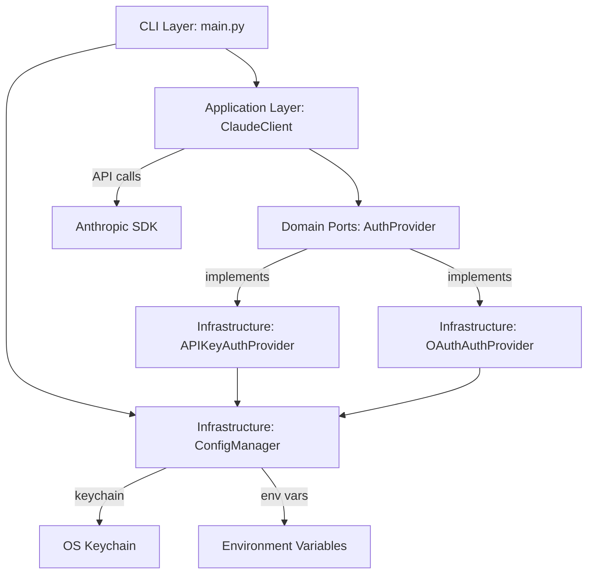

# Task Specification: System Architect

**Agent**: system-architect
**Phase**: Phase 2 - Technical Requirements & System Architecture
**Deliverable**: `04_system_architecture.md`
**Estimated Duration**: 2-3 days
**Parallel with**: technical-requirements-analyst (coordinate on shared interfaces)

---

## Mission Statement

Design comprehensive system architecture for dual-mode (API key + OAuth) authentication in Abathur's agent spawning system. Create AuthProvider abstraction, specify component interactions, design token lifecycle management, and ensure architecture maintains Clean Architecture principles.

---

## Context and Background

**Project**: OAuth-Based Agent Spawning for Abathur

**Current Architecture**:
- **Clean Architecture**: Domain → Application → Infrastructure → Interface layers
- **Dependency Injection**: All components receive dependencies via constructor
- **Single Auth Point**: ClaudeClient.__init__() handles authentication
- **Credential Management**: ConfigManager loads from env vars, keychain, or .env file
- **Type Safety**: Comprehensive type hints, Pydantic models for validation

**Desired Architecture**:
- **AuthProvider Abstraction**: Interface for API key and OAuth implementations
- **Dual-Mode Support**: Seamless switching between API key and OAuth
- **Token Lifecycle**: Automatic refresh, expiry detection, credential rotation
- **Context Window Warnings**: User-friendly alerts for large inputs
- **Rate Limit Tracking**: Usage monitoring and threshold warnings
- **Backward Compatibility**: Zero breaking changes for API key users

**Phase 1 Outcomes**:
- 8 integration points identified with file:line precision
- Clean Architecture validated (supports OAuth integration cleanly)
- Zero breaking changes confirmed (all changes additive)
- Critical constraints documented (context window, rate limits, token lifecycle)

---

## Your Responsibilities

### Primary Deliverables

1. **AuthProvider Abstraction Design** (interface + implementations)
2. **System Architecture Diagrams** (component, sequence, flow)
3. **Token Lifecycle Management Specification**
4. **Configuration System Extensions**
5. **Error Handling Architecture** (exception hierarchy)
6. **Context Window Warning System Design**
7. **Rate Limit Tracking Architecture**
8. **Logging and Observability Design**
9. **Security Architecture**

### Secondary Deliverables

1. **Integration Patterns** (how components interact)
2. **Code Structure Recommendations** (file organization)
3. **Testing Architecture** (mock strategies, test patterns)

---

## Detailed Task Breakdown

### Task 1: AuthProvider Abstraction Design (CRITICAL - Day 1)

**Objective**: Design abstract base class for authentication providers and specify concrete implementations.

#### 1.1 AuthProvider Interface Design

**Location**: `src/abathur/domain/ports/auth_provider.py` (new file, domain layer)

**Interface Specification**:

```python
from abc import ABC, abstractmethod
from typing import Literal
from datetime import datetime

class AuthProvider(ABC):
    """Abstract authentication provider for Claude API."""

    @abstractmethod
    async def get_credentials(self) -> dict[str, str]:
        """Get credentials for API requests.

        Returns:
            Dict with keys:
            - 'type': 'api_key' | 'bearer'
            - 'value': credential value
            - 'expires_at': (optional) ISO timestamp for OAuth tokens

        Raises:
            AuthenticationError: If credentials invalid or unavailable
            OAuthTokenExpiredError: If OAuth token expired and refresh failed
        """
        pass

    @abstractmethod
    async def refresh_credentials(self) -> bool:
        """Refresh expired credentials.

        Returns:
            True if refresh successful, False otherwise

        Raises:
            OAuthRefreshError: If refresh fails after retries
        """
        pass

    @abstractmethod
    def is_valid(self) -> bool:
        """Check if current credentials are valid and not expired.

        Returns:
            True if credentials valid, False otherwise
        """
        pass

    @abstractmethod
    def get_auth_method(self) -> Literal["api_key", "oauth"]:
        """Get authentication method type.

        Returns:
            'api_key' or 'oauth'
        """
        pass

    @abstractmethod
    async def validate(self) -> bool:
        """Validate credentials with a test request.

        Returns:
            True if credentials work, False otherwise

        Note:
            May incur API costs (makes real request to Claude API)
        """
        pass
```

**Design Decisions to Document**:
- Why domain/ports layer? (Clean Architecture - domain defines interfaces, infrastructure implements)
- Why async methods? (ClaudeClient uses async, consistency)
- Why dict return from get_credentials()? (flexibility for different auth types)
- Error handling strategy (exceptions vs return codes)

#### 1.2 APIKeyAuthProvider Design

**Location**: `src/abathur/infrastructure/api_key_auth.py` (new file, infrastructure layer)

**Implementation Specification**:

```python
from abathur.domain.ports.auth_provider import AuthProvider
from abathur.infrastructure.config import ConfigManager
from typing import Literal

class APIKeyAuthProvider(AuthProvider):
    """API key authentication provider.

    Wraps existing API key logic from ConfigManager.
    """

    def __init__(self, api_key: str | None = None, config_manager: ConfigManager | None = None):
        """Initialize API key provider.

        Args:
            api_key: Optional API key (if None, loaded from config_manager)
            config_manager: Optional ConfigManager (if None, created)
        """
        self.config_manager = config_manager or ConfigManager()
        self.api_key = api_key or self.config_manager.get_api_key()

    async def get_credentials(self) -> dict[str, str]:
        """Get API key credentials.

        Returns:
            {'type': 'api_key', 'value': self.api_key}
        """
        return {
            "type": "api_key",
            "value": self.api_key,
        }

    async def refresh_credentials(self) -> bool:
        """API keys don't expire, no refresh needed.

        Returns:
            True (always successful, no-op)
        """
        return True

    def is_valid(self) -> bool:
        """Check if API key is set.

        Returns:
            True if api_key is not None and not empty
        """
        return self.api_key is not None and len(self.api_key) > 0

    def get_auth_method(self) -> Literal["api_key", "oauth"]:
        """Return 'api_key'."""
        return "api_key"

    async def validate(self) -> bool:
        """Validate API key with test request to Claude API.

        Uses existing ClaudeClient.validate_api_key() logic.

        Returns:
            True if API key works
        """
        # Use Anthropic SDK to make test request
        # (Implementation deferred to code phase)
        pass
```

**Design Decisions to Document**:
- Constructor parameters (api_key optional for backward compatibility)
- Why config_manager dependency? (reuse existing credential loading)
- Why refresh_credentials() is no-op? (API keys don't expire)

#### 1.3 OAuthAuthProvider Design

**Location**: `src/abathur/infrastructure/oauth_auth.py` (new file, infrastructure layer)

**Implementation Specification**:

```python
from abathur.domain.ports.auth_provider import AuthProvider
from abathur.infrastructure.config import ConfigManager
from abathur.infrastructure.exceptions import OAuthTokenExpiredError, OAuthRefreshError
from datetime import datetime, timedelta, timezone
from typing import Literal
import httpx  # If SDK doesn't support OAuth
import structlog

logger = structlog.get_logger()

class OAuthAuthProvider(AuthProvider):
    """OAuth authentication provider with automatic token refresh."""

    def __init__(
        self,
        access_token: str | None = None,
        refresh_token: str | None = None,
        expires_at: datetime | None = None,
        config_manager: ConfigManager | None = None,
        max_refresh_retries: int = 3,
    ):
        """Initialize OAuth provider.

        Args:
            access_token: OAuth access token (if None, loaded from config_manager)
            refresh_token: OAuth refresh token (if None, loaded from config_manager)
            expires_at: Token expiry timestamp (if None, loaded from config_manager)
            config_manager: ConfigManager instance
            max_refresh_retries: Maximum refresh attempts before failing
        """
        self.config_manager = config_manager or ConfigManager()
        self.max_refresh_retries = max_refresh_retries

        # Load tokens from config if not provided
        if access_token is None:
            self.access_token = self.config_manager.get_oauth_token()
            self.refresh_token = self.config_manager.get_oauth_refresh_token()
            self.expires_at = self.config_manager.get_oauth_token_expiry()
        else:
            self.access_token = access_token
            self.refresh_token = refresh_token
            self.expires_at = expires_at

    async def get_credentials(self) -> dict[str, str]:
        """Get OAuth credentials, refreshing if expired.

        Returns:
            {'type': 'bearer', 'value': access_token, 'expires_at': ISO timestamp}

        Raises:
            OAuthTokenExpiredError: If token expired and refresh failed
        """
        # Check if token is expired (with 5-minute buffer)
        if self._is_expired():
            logger.info("oauth_token_expired_attempting_refresh")
            if not await self.refresh_credentials():
                raise OAuthTokenExpiredError(
                    "OAuth token has expired and refresh failed. "
                    "Run `abathur config oauth-login` to re-authenticate."
                )

        return {
            "type": "bearer",
            "value": self.access_token,
            "expires_at": self.expires_at.isoformat(),
        }

    async def refresh_credentials(self) -> bool:
        """Refresh OAuth token using refresh token.

        Returns:
            True if refresh successful, False otherwise

        Raises:
            OAuthRefreshError: If refresh fails after max retries
        """
        for attempt in range(self.max_refresh_retries):
            try:
                logger.info("oauth_token_refresh_attempt", attempt=attempt + 1)

                # Call OAuth token refresh endpoint
                new_tokens = await self._call_refresh_endpoint()

                # Update tokens
                self.access_token = new_tokens["access_token"]
                self.refresh_token = new_tokens.get("refresh_token", self.refresh_token)
                self.expires_at = datetime.now(timezone.utc) + timedelta(
                    seconds=new_tokens["expires_in"]
                )

                # Persist new tokens to storage
                self.config_manager.set_oauth_token(
                    access_token=self.access_token,
                    refresh_token=self.refresh_token,
                    expires_at=self.expires_at,
                )

                logger.info(
                    "oauth_token_refreshed",
                    expires_at=self.expires_at.isoformat(),
                    attempt=attempt + 1,
                )
                return True

            except Exception as e:
                logger.warning(
                    "oauth_token_refresh_failed",
                    attempt=attempt + 1,
                    error=str(e),
                )
                if attempt == self.max_refresh_retries - 1:
                    raise OAuthRefreshError(
                        f"Failed to refresh OAuth token after {self.max_refresh_retries} attempts: {e}"
                    ) from e

        return False

    def is_valid(self) -> bool:
        """Check if token is valid and not expired.

        Returns:
            True if access_token exists and not expired
        """
        return self.access_token is not None and not self._is_expired()

    def get_auth_method(self) -> Literal["api_key", "oauth"]:
        """Return 'oauth'."""
        return "oauth"

    async def validate(self) -> bool:
        """Validate OAuth token with test request.

        Returns:
            True if token works

        Note:
            May trigger token refresh if expired
        """
        try:
            credentials = await self.get_credentials()
            # Make test request to Claude API
            # (Implementation deferred to code phase)
            return True
        except OAuthTokenExpiredError:
            return False

    def _is_expired(self) -> bool:
        """Check if access token is expired (with 5-minute buffer).

        Returns:
            True if expired or expiring within 5 minutes
        """
        if self.expires_at is None:
            return True
        now = datetime.now(timezone.utc)
        buffer = timedelta(minutes=5)
        return now >= (self.expires_at - buffer)

    async def _call_refresh_endpoint(self) -> dict:
        """Call OAuth refresh endpoint.

        Returns:
            Dict with:
            - access_token: str
            - refresh_token: str (optional, may rotate)
            - expires_in: int (seconds)

        Raises:
            httpx.HTTPStatusError: If endpoint returns error
        """
        # TODO: Verify endpoint from technical-requirements-analyst
        endpoint = "https://console.anthropic.com/v1/oauth/token"
        client_id = "9d1c250a-e61b-44d9-88ed-5944d1962f5e"  # Claude Code client ID

        async with httpx.AsyncClient() as client:
            response = await client.post(
                endpoint,
                json={
                    "grant_type": "refresh_token",
                    "refresh_token": self.refresh_token,
                    "client_id": client_id,
                },
                headers={"Content-Type": "application/json"},
                timeout=10.0,
            )

            response.raise_for_status()
            return response.json()
```

**Design Decisions to Document**:
- Why 5-minute expiry buffer? (clock skew, network latency)
- Why 3 refresh retries by default? (per Decision #4)
- Why httpx for refresh endpoint? (may need if SDK doesn't support OAuth)
- Token rotation handling (some OAuth servers rotate refresh tokens)

**Deliverable**: Section in `04_system_architecture.md` titled "AuthProvider Abstraction Design"

**Success Criteria**:
- Interface clearly defined with method signatures, parameters, return types, exceptions
- APIKeyAuthProvider wraps existing API key logic (no duplication)
- OAuthAuthProvider implements token refresh with retry logic
- Code snippets are complete (not pseudocode)
- Coordinate with technical-requirements-analyst on method names

---

### Task 2: System Architecture Diagrams (Day 1-2)

**Objective**: Create visual diagrams showing component interactions, sequence flows, and data flow.

#### 2.1 High-Level Component Diagram

**Show**:
- All layers: Domain, Application, Infrastructure, Interface (CLI)
- AuthProvider abstraction in domain/ports
- APIKeyAuthProvider and OAuthAuthProvider in infrastructure
- ClaudeClient in application (uses AuthProvider)
- ConfigManager in infrastructure (credential storage)
- CLI in interface (service initialization)

**Format**: ASCII art, Mermaid, or PlantUML

**Example (Mermaid)**:


#### 2.2 Dual-Mode Authentication Flow

**Show**:
- User provides credential (API key or OAuth token)
- ConfigManager.detect_auth_method() determines type
- Appropriate AuthProvider instantiated
- AuthProvider passed to ClaudeClient
- ClaudeClient uses AuthProvider.get_credentials()

**Format**: Sequence diagram

**Example**:
```
User -> CLI: abathur task submit ...
CLI -> ConfigManager: get_auth_credentials()
ConfigManager -> ConfigManager: detect_auth_method(key_prefix)
alt API Key detected
    ConfigManager -> APIKeyAuthProvider: new(api_key)
else OAuth detected
    ConfigManager -> OAuthAuthProvider: new(access_token, refresh_token, expires_at)
end
CLI -> ClaudeClient: new(auth_provider)
ClaudeClient -> AuthProvider: get_credentials()
AuthProvider -> ClaudeClient: {'type': 'api_key'/'bearer', 'value': '...'}
ClaudeClient -> Anthropic SDK: messages.create(auth=credentials)
```

#### 2.3 Token Refresh Sequence Diagram

**Show**:
- ClaudeClient.execute_task() calls API
- API returns 401 Unauthorized (token expired)
- ClaudeClient calls AuthProvider.refresh_credentials()
- OAuthAuthProvider calls refresh endpoint
- New tokens stored in ConfigManager
- Original request retried with new token

**Format**: Sequence diagram

#### 2.4 Context Window Warning Flow

**Show**:
- User submits task with large input
- ClaudeClient calculates token count
- Token count exceeds OAuth limit (200K)
- Warning displayed to user
- User chooses: abort, override, or switch to API key

**Format**: Flow diagram

#### 2.5 Rate Limit Tracking Flow

**Show**:
- ClaudeClient logs request to usage tracker
- Usage tracker checks current 5-hour window usage
- If approaching threshold (80%), warn user
- If exceeded limit, return error with retry suggestion

**Format**: Flow diagram

**Deliverable**: Section in `04_system_architecture.md` titled "Architecture Diagrams"

**Success Criteria**:
- Minimum 5 diagrams (component, dual-mode flow, token refresh, context warning, rate limit)
- Diagrams show all integration points from Phase 1
- Diagrams use consistent notation and terminology
- Diagrams are readable (not too cluttered)

---

### Task 3: Token Lifecycle Management Specification (Day 2)

**Objective**: Specify complete token lifecycle from acquisition to expiration and refresh.

#### 3.1 Token Storage Architecture

**Storage Locations** (priority order):
1. **Environment Variables** (development, CI/CD):
   - `ANTHROPIC_AUTH_TOKEN`: Access token
   - `ANTHROPIC_REFRESH_TOKEN`: Refresh token
   - `ANTHROPIC_TOKEN_EXPIRY`: ISO timestamp

2. **System Keychain** (production):
   - macOS Keychain: `security add-generic-password -s "abathur" -a "anthropic_oauth_access_token" -w <token>`
   - Linux Secret Service: via `keyring` library
   - Keys:
     - `anthropic_oauth_access_token`
     - `anthropic_oauth_refresh_token`
     - `anthropic_oauth_token_expiry`

3. **.env File** (local development):
   - `ANTHROPIC_AUTH_TOKEN=...`
   - `ANTHROPIC_REFRESH_TOKEN=...`
   - `ANTHROPIC_TOKEN_EXPIRY=...`

**ConfigManager Extensions**:

```python
class ConfigManager:
    # Existing methods...

    def get_oauth_token(self) -> str:
        """Get OAuth access token.

        Priority: env var > keychain > .env file

        Returns:
            Access token

        Raises:
            ValueError: If token not found
        """
        # Check ANTHROPIC_AUTH_TOKEN env var
        if token := os.getenv("ANTHROPIC_AUTH_TOKEN"):
            return token

        # Check keychain
        try:
            if token := keyring.get_password("abathur", "anthropic_oauth_access_token"):
                return token
        except Exception:
            pass

        # Check .env file
        env_file = self.project_root / ".env"
        if env_file.exists():
            # Parse ANTHROPIC_AUTH_TOKEN=...
            ...

        raise ValueError("OAuth token not found. Run `abathur config oauth-login`")

    def get_oauth_refresh_token(self) -> str:
        """Get OAuth refresh token (similar to get_oauth_token)."""
        ...

    def get_oauth_token_expiry(self) -> datetime:
        """Get OAuth token expiry timestamp.

        Returns:
            datetime in UTC

        Raises:
            ValueError: If expiry not found or invalid format
        """
        ...

    def set_oauth_token(
        self,
        access_token: str,
        refresh_token: str,
        expires_at: datetime,
        use_keychain: bool = True,
    ) -> None:
        """Store OAuth tokens securely.

        Args:
            access_token: OAuth access token
            refresh_token: OAuth refresh token
            expires_at: Token expiry timestamp (UTC)
            use_keychain: If True, store in keychain; else .env file
        """
        if use_keychain:
            keyring.set_password("abathur", "anthropic_oauth_access_token", access_token)
            keyring.set_password("abathur", "anthropic_oauth_refresh_token", refresh_token)
            keyring.set_password(
                "abathur", "anthropic_oauth_token_expiry", expires_at.isoformat()
            )
        else:
            # Append to .env file
            ...

    def detect_auth_method(self, credential: str) -> Literal["api_key", "oauth"]:
        """Detect authentication method from credential format.

        Per Decision #2: Auto-detect via key prefix

        Args:
            credential: API key or OAuth token

        Returns:
            'api_key' if starts with 'sk-ant-api', 'oauth' otherwise

        Raises:
            ValueError: If credential format unrecognized
        """
        if credential.startswith("sk-ant-api"):
            return "api_key"
        elif credential.startswith("eyJ"):  # JWT tokens start with eyJ (base64 '{"')
            return "oauth"
        else:
            raise ValueError(f"Unrecognized credential format: {credential[:10]}...")
```

#### 3.2 Token Expiry Detection

**Proactive Expiry Check**:
- Before each request, check `expires_at` timestamp
- If within 5 minutes of expiry, trigger refresh
- Prevents mid-request expiration

**Reactive Expiry Handling**:
- Catch 401 Unauthorized from API
- Trigger refresh automatically
- Retry original request with new token

**Code Integration**:

```python
class ClaudeClient:
    async def execute_task(self, ...) -> dict[str, Any]:
        """Execute task with automatic token refresh."""

        for attempt in range(self.max_retries):
            try:
                # Get credentials (may trigger refresh if expired)
                credentials = await self.auth_provider.get_credentials()

                # Initialize SDK client with credentials
                if credentials["type"] == "api_key":
                    client = AsyncAnthropic(api_key=credentials["value"])
                elif credentials["type"] == "bearer":
                    client = AsyncAnthropic(auth_token=credentials["value"])  # Verify SDK support

                # Make API request
                response = await client.messages.create(...)

                return {"success": True, "content": ...}

            except httpx.HTTPStatusError as e:
                if e.response.status_code == 401:
                    # Token expired, attempt refresh
                    if attempt < self.max_retries - 1:
                        await self.auth_provider.refresh_credentials()
                        continue
                    else:
                        raise OAuthTokenExpiredError("Max refresh attempts exceeded")
                else:
                    raise  # Other HTTP errors

        return {"success": False, "error": "Max retries exceeded"}
```

#### 3.3 Credential Rotation

**Refresh Token Rotation**:
- Some OAuth servers rotate refresh tokens on each refresh
- Handle optional `refresh_token` in refresh response
- Update stored refresh token if new one provided

**Implementation**:
```python
new_tokens = await self._call_refresh_endpoint()

# Update access token (always new)
self.access_token = new_tokens["access_token"]

# Update refresh token (may rotate)
if "refresh_token" in new_tokens:
    self.refresh_token = new_tokens["refresh_token"]
# else: keep existing refresh token
```

**Deliverable**: Section in `04_system_architecture.md` titled "Token Lifecycle Management"

**Success Criteria**:
- All token storage locations specified (env vars, keychain, .env file)
- ConfigManager extensions fully specified with method signatures
- Expiry detection logic clear (proactive + reactive)
- Credential rotation handled (refresh token may rotate)

---

### Task 4: Configuration System Extensions (Day 2)

**Objective**: Extend Abathur's configuration schema to support OAuth-specific settings.

#### 4.1 Config Model Extensions

**Current Config Model** (`src/abathur/infrastructure/config.py`):
```python
class Config(BaseModel):
    version: str = "0.1.0"
    log_level: str = "INFO"
    queue: QueueConfig = Field(default_factory=QueueConfig)
    swarm: SwarmConfig = Field(default_factory=SwarmConfig)
    loop: LoopConfig = Field(default_factory=LoopConfig)
    resources: ResourceConfig = Field(default_factory=ResourceConfig)
    monitoring: MonitoringConfig = Field(default_factory=MonitoringConfig)
```

**New OAuth Config Model**:
```python
from pydantic import BaseModel, Field

class AuthConfig(BaseModel):
    """Authentication configuration."""

    mode: Literal["auto", "api_key", "oauth"] = "auto"
    """Authentication mode: 'auto' (detect), 'api_key', or 'oauth'"""

    oauth_token_storage: Literal["keychain", "env", "file"] = "keychain"
    """Where to store OAuth tokens: 'keychain', 'env', or 'file'"""

    oauth_auto_refresh: bool = True
    """Automatically refresh expired OAuth tokens"""

    oauth_refresh_retries: int = 3
    """Maximum token refresh retry attempts"""

    context_window_warning_threshold: float = 0.9
    """Warn when input exceeds this % of context window (0.9 = 90%)"""

    rate_limit_warning_threshold: float = 0.8
    """Warn when usage exceeds this % of rate limit (0.8 = 80%)"""

class Config(BaseModel):
    version: str = "0.1.0"
    log_level: str = "INFO"
    auth: AuthConfig = Field(default_factory=AuthConfig)  # NEW
    queue: QueueConfig = Field(default_factory=QueueConfig)
    swarm: SwarmConfig = Field(default_factory=SwarmConfig)
    loop: LoopConfig = Field(default_factory=LoopConfig)
    resources: ResourceConfig = Field(default_factory=ResourceConfig)
    monitoring: MonitoringConfig = Field(default_factory=MonitoringConfig)
```

#### 4.2 Config File Format

**YAML Configuration** (`.abathur/config.yaml`):
```yaml
version: "0.1.0"
log_level: "INFO"

# NEW: Authentication configuration
auth:
  mode: "auto"  # auto | api_key | oauth
  oauth_token_storage: "keychain"  # keychain | env | file
  oauth_auto_refresh: true
  oauth_refresh_retries: 3
  context_window_warning_threshold: 0.9  # Warn at 90% of context window
  rate_limit_warning_threshold: 0.8  # Warn at 80% of rate limit

queue:
  max_size: 1000
  default_priority: 5

# ... existing config ...
```

#### 4.3 Environment Variable Overrides

**New Environment Variables**:
- `ABATHUR_AUTH_MODE`: Override auth mode (auto | api_key | oauth)
- `ABATHUR_OAUTH_TOKEN_STORAGE`: Override token storage location
- `ABATHUR_OAUTH_AUTO_REFRESH`: Override auto-refresh (true | false)
- `ABATHUR_OAUTH_REFRESH_RETRIES`: Override retry count (integer)

**Environment Variable Mapping** (extend `ConfigManager._apply_env_vars`):
```python
env_mappings = {
    # Existing mappings...
    "ABATHUR_AUTH_MODE": ["auth", "mode"],
    "ABATHUR_OAUTH_TOKEN_STORAGE": ["auth", "oauth_token_storage"],
    "ABATHUR_OAUTH_AUTO_REFRESH": ["auth", "oauth_auto_refresh"],
    "ABATHUR_OAUTH_REFRESH_RETRIES": ["auth", "oauth_refresh_retries"],
}
```

**Deliverable**: Section in `04_system_architecture.md` titled "Configuration System Extensions"

**Success Criteria**:
- AuthConfig Pydantic model fully specified
- All OAuth settings have sensible defaults
- YAML config format documented with examples
- Environment variable overrides specified

---

### Task 5: Error Handling Architecture (Day 2)

**Objective**: Design custom exception hierarchy for OAuth-specific errors.

#### 5.1 Exception Hierarchy

**New File**: `src/abathur/infrastructure/exceptions.py`

**Exception Classes**:

```python
class AbathurError(Exception):
    """Base exception for all Abathur errors."""
    pass


class AuthenticationError(AbathurError):
    """Base exception for authentication failures."""

    def __init__(self, message: str, remediation: str | None = None):
        """Initialize authentication error.

        Args:
            message: Error description
            remediation: User-facing remediation steps
        """
        super().__init__(message)
        self.remediation = remediation


class APIKeyInvalidError(AuthenticationError):
    """API key is invalid or expired."""

    def __init__(self, message: str = "API key is invalid"):
        super().__init__(
            message=message,
            remediation=(
                "Verify your API key at https://console.anthropic.com/settings/keys\n"
                "Then run: abathur config set-key <your-api-key>"
            ),
        )


class OAuthTokenExpiredError(AuthenticationError):
    """OAuth token has expired and refresh failed."""

    def __init__(self, message: str = "OAuth token expired and refresh failed"):
        super().__init__(
            message=message,
            remediation=(
                "Re-authenticate with OAuth:\n"
                "  1. Run: abathur config oauth-login\n"
                "  2. Follow browser authentication flow\n"
                "  3. Retry your command"
            ),
        )


class OAuthRefreshError(AuthenticationError):
    """Failed to refresh OAuth token."""

    def __init__(self, message: str, attempts: int = 0):
        super().__init__(
            message=message,
            remediation=(
                f"Token refresh failed after {attempts} attempts.\n"
                "Possible causes:\n"
                "  - Network connectivity issues\n"
                "  - Refresh token expired (requires re-authentication)\n"
                "  - Anthropic OAuth service unavailable\n"
                "\n"
                "Try: abathur config oauth-login"
            ),
        )
        self.attempts = attempts


class ContextWindowExceededError(AbathurError):
    """Task input exceeds authentication method's context window."""

    def __init__(
        self,
        estimated_tokens: int,
        context_limit: int,
        auth_method: str,
    ):
        message = (
            f"Task input exceeds {auth_method} context window.\n"
            f"  Estimated tokens: {estimated_tokens:,}\n"
            f"  {auth_method} limit: {context_limit:,} tokens"
        )
        super().__init__(message)
        self.estimated_tokens = estimated_tokens
        self.context_limit = context_limit
        self.auth_method = auth_method


class RateLimitExceededError(AbathurError):
    """Rate limit exceeded for authentication method."""

    def __init__(
        self,
        current_usage: int,
        limit: int,
        reset_time: datetime,
        auth_method: str,
    ):
        reset_str = reset_time.strftime("%Y-%m-%d %H:%M:%S %Z")
        message = (
            f"Rate limit exceeded for {auth_method}.\n"
            f"  Current usage: {current_usage}/{limit} requests\n"
            f"  Limit resets at: {reset_str}\n"
        )
        super().__init__(message)
        self.current_usage = current_usage
        self.limit = limit
        self.reset_time = reset_time
```

#### 5.2 Error Propagation Strategy

**Principle**: Fail fast with clear errors, provide remediation steps

**Error Handling Layers**:

1. **AuthProvider Layer**: Raise specific errors (OAuthTokenExpiredError, OAuthRefreshError)
2. **ClaudeClient Layer**: Catch auth errors, retry if appropriate, re-raise with context
3. **AgentExecutor Layer**: Catch all errors, log to audit trail, return Result with error
4. **CLI Layer**: Catch errors, display formatted error + remediation, exit with code 1

**Example Error Flow**:
```
OAuthAuthProvider.get_credentials()
  ↓ raises OAuthTokenExpiredError
ClaudeClient.execute_task()
  ↓ catches, logs, re-raises (or retries)
AgentExecutor.execute_task()
  ↓ catches, creates Result(success=False, error=...)
CLI command
  ↓ catches, displays error message + remediation
  ↓ exit(1)
```

#### 5.3 User-Facing Error Messages

**Format**:
```
❌ Error: [Error type]

[Error message]

💡 How to Fix:
[Remediation steps]

[Optional: Debug info if --verbose flag]
```

**Example**:
```
❌ Error: OAuth Token Expired

OAuth token has expired and refresh failed.

💡 How to Fix:
Re-authenticate with OAuth:
  1. Run: abathur config oauth-login
  2. Follow browser authentication flow
  3. Retry your command

Debug Info (--verbose):
  - Token expired at: 2025-10-09 14:30:00 UTC
  - Refresh attempts: 3
  - Last error: HTTP 400 - Invalid refresh token
```

**Deliverable**: Section in `04_system_architecture.md` titled "Error Handling Architecture"

**Success Criteria**:
- Complete exception hierarchy (5+ exception classes)
- All exceptions have remediation steps
- Error propagation strategy clear
- User-facing error message format specified

---

### Task 6: Context Window Warning System (Day 2)

**Objective**: Design user-friendly warning system for tasks exceeding OAuth context window.

#### 6.1 Token Counting Mechanism

**Options**:
1. **Exact Counting** (tiktoken library):
   - Pros: Accurate token count
   - Cons: Additional dependency, CPU overhead

2. **Approximation** (4 chars ≈ 1 token):
   - Pros: Fast, no dependencies
   - Cons: ~15-20% error margin

**Recommendation**: Start with approximation, upgrade to tiktoken if needed

**Implementation**:
```python
def estimate_token_count(text: str) -> int:
    """Estimate token count from text length.

    Uses approximation: 1 token ≈ 4 characters

    Args:
        text: Input text

    Returns:
        Estimated token count
    """
    return len(text) // 4


# Future: Exact counting with tiktoken
# import tiktoken
# def count_tokens_exact(text: str, model: str) -> int:
#     encoding = tiktoken.encoding_for_model(model)
#     return len(encoding.encode(text))
```

#### 6.2 Warning Trigger Points

**Thresholds** (configurable via `auth.context_window_warning_threshold`):
- **Default**: 90% of context window (180K tokens for OAuth, 900K for API key)
- **Configurable**: User can set 0.0-1.0 (0% to 100%)

**When to Check**:
- Before task submission in `ClaudeClient.execute_task()`
- Calculate: system_prompt + user_message + buffer (5K for response)

**Logic**:
```python
async def execute_task(self, system_prompt: str, user_message: str, ...) -> dict:
    """Execute task with context window check."""

    # Calculate input token count
    estimated_tokens = estimate_token_count(system_prompt) + estimate_token_count(user_message)
    response_buffer = 5000  # Reserve for response
    total_estimated = estimated_tokens + response_buffer

    # Get auth method and context limit
    auth_method = self.auth_provider.get_auth_method()
    context_limit = 200_000 if auth_method == "oauth" else 1_000_000

    # Check threshold
    threshold = self.config.auth.context_window_warning_threshold
    if total_estimated > (context_limit * threshold):
        self._warn_context_window(total_estimated, context_limit, auth_method)

    # Proceed with request...
```

#### 6.3 Warning Display (CLI)

**Warning Message Format**:
```
⚠️  Context Window Warning

Your task input is approaching the {auth_method} context window limit.

  Estimated tokens:  {estimated_tokens:,} tokens
  {auth_method} limit:       {context_limit:,} tokens
  Usage:             {percentage:.1f}%

⚡ Recommendations:
  1. Reduce input size (remove files, shorten prompt)
  2. Switch to API key authentication (1M token limit)
  3. Continue anyway (may fail with API error)

Continue? (y/n):
```

**Implementation**:
```python
def _warn_context_window(
    self,
    estimated_tokens: int,
    context_limit: int,
    auth_method: str,
) -> None:
    """Display context window warning to user.

    Args:
        estimated_tokens: Estimated input + response tokens
        context_limit: Context window limit for auth method
        auth_method: 'api_key' or 'oauth'
    """
    from rich.console import Console

    console = Console()

    percentage = (estimated_tokens / context_limit) * 100

    console.print(f"\n[yellow]⚠️  Context Window Warning[/yellow]\n")
    console.print(f"Your task input is approaching the {auth_method} context window limit.\n")
    console.print(f"  Estimated tokens:  [bold]{estimated_tokens:,}[/bold] tokens")
    console.print(f"  {auth_method} limit:       [bold]{context_limit:,}[/bold] tokens")
    console.print(f"  Usage:             [bold]{percentage:.1f}%[/bold]\n")
    console.print("⚡ [bold]Recommendations:[/bold]")
    console.print("  1. Reduce input size (remove files, shorten prompt)")

    if auth_method == "oauth":
        console.print("  2. Switch to API key authentication (1M token limit)")

    console.print("  3. Continue anyway (may fail with API error)\n")

    # Prompt user (if interactive)
    if sys.stdin.isatty():
        response = input("Continue? (y/n): ")
        if response.lower() != "y":
            raise ContextWindowExceededError(estimated_tokens, context_limit, auth_method)
```

**Deliverable**: Section in `04_system_architecture.md` titled "Context Window Warning System"

**Success Criteria**:
- Token counting mechanism specified (approximation recommended)
- Warning thresholds configurable
- Warning display format user-friendly
- User can override warning (interactive mode)

---

### Task 7: Rate Limit Tracking Architecture (Day 2)

**Objective**: Design usage tracking system for OAuth rate limits.

#### 7.1 Usage Tracker Design

**Storage**: SQLite database (reuse existing `abathur.db`)

**New Table**:
```sql
CREATE TABLE oauth_usage (
    id INTEGER PRIMARY KEY AUTOINCREMENT,
    timestamp DATETIME NOT NULL,
    auth_method TEXT NOT NULL,  -- 'api_key' or 'oauth'
    tokens_used INTEGER NOT NULL,
    model TEXT NOT NULL,
    created_at DATETIME DEFAULT CURRENT_TIMESTAMP
);

CREATE INDEX idx_oauth_usage_timestamp ON oauth_usage(timestamp);
CREATE INDEX idx_oauth_usage_auth_method ON oauth_usage(auth_method);
```

**Usage Tracking**:
```python
class UsageTracker:
    """Track OAuth usage for rate limit monitoring."""

    def __init__(self, database: Database):
        self.database = database

    async def log_request(
        self,
        auth_method: str,
        tokens_used: int,
        model: str,
    ) -> None:
        """Log a request to usage tracker.

        Args:
            auth_method: 'api_key' or 'oauth'
            tokens_used: Total tokens (input + output)
            model: Model name
        """
        await self.database.execute(
            """
            INSERT INTO oauth_usage (timestamp, auth_method, tokens_used, model)
            VALUES (?, ?, ?, ?)
            """,
            (datetime.now(timezone.utc), auth_method, tokens_used, model),
        )

    async def get_usage_5h_window(self, auth_method: str) -> int:
        """Get request count in last 5 hours.

        Args:
            auth_method: 'api_key' or 'oauth'

        Returns:
            Number of requests in last 5 hours
        """
        cutoff = datetime.now(timezone.utc) - timedelta(hours=5)
        result = await self.database.fetchone(
            """
            SELECT COUNT(*) as count
            FROM oauth_usage
            WHERE auth_method = ? AND timestamp >= ?
            """,
            (auth_method, cutoff),
        )
        return result["count"] if result else 0

    async def check_rate_limit(
        self,
        auth_method: str,
        limit: int,
        threshold: float = 0.8,
    ) -> tuple[bool, int, int]:
        """Check if approaching rate limit.

        Args:
            auth_method: 'api_key' or 'oauth'
            limit: Maximum requests per 5 hours (e.g., 200 for Max 5x)
            threshold: Warning threshold (default 0.8 = 80%)

        Returns:
            Tuple of (warn, current_usage, limit)
        """
        current_usage = await self.get_usage_5h_window(auth_method)
        warn = current_usage >= (limit * threshold)
        return (warn, current_usage, limit)
```

#### 7.2 Rate Limit Integration

**ClaudeClient Integration**:
```python
class ClaudeClient:
    def __init__(self, auth_provider: AuthProvider, usage_tracker: UsageTracker | None = None):
        self.auth_provider = auth_provider
        self.usage_tracker = usage_tracker

    async def execute_task(self, ...) -> dict:
        # Before request: Check rate limit
        if self.usage_tracker and self.auth_provider.get_auth_method() == "oauth":
            # Determine limit based on subscription tier (hardcoded for now)
            limit = 200  # Max 5x default, TODO: detect tier
            warn, current, max_limit = await self.usage_tracker.check_rate_limit("oauth", limit)

            if warn:
                logger.warning(
                    "rate_limit_warning",
                    current=current,
                    limit=max_limit,
                    percentage=(current / max_limit) * 100,
                )
                # Display warning to user (if CLI)

        # Make request...
        response = await self.async_client.messages.create(...)

        # After request: Log usage
        if self.usage_tracker:
            tokens_used = response.usage.input_tokens + response.usage.output_tokens
            await self.usage_tracker.log_request(
                auth_method=self.auth_provider.get_auth_method(),
                tokens_used=tokens_used,
                model=model_to_use,
            )

        return {"success": True, ...}
```

**Deliverable**: Section in `04_system_architecture.md` titled "Rate Limit Tracking Architecture"

**Success Criteria**:
- Usage tracking database schema specified
- UsageTracker class design complete
- Integration with ClaudeClient clear
- Rate limit warnings configurable

---

### Task 8: Logging and Observability Design (Day 3)

**Objective**: Specify logging points for OAuth authentication events, token lifecycle, and usage metrics.

#### 8.1 Authentication Event Logging

**Log Points**:

1. **Client Initialization**:
   ```python
   logger.info(
       "claude_client_initialized",
       auth_method=self.auth_provider.get_auth_method(),
       model=self.model,
   )
   ```

2. **Credential Retrieval**:
   ```python
   logger.debug(
       "auth_credentials_retrieved",
       auth_type=credentials["type"],
       expires_at=credentials.get("expires_at"),
   )
   ```

3. **Authentication Success**:
   ```python
   logger.info("auth_success", auth_method=auth_method)
   ```

4. **Authentication Failure**:
   ```python
   logger.error(
       "auth_failure",
       auth_method=auth_method,
       error_type=type(e).__name__,
       error=str(e),
   )
   ```

#### 8.2 Token Lifecycle Logging

**Log Points**:

1. **Token Refresh Initiated**:
   ```python
   logger.info("oauth_token_refresh_initiated", expires_at=self.expires_at.isoformat())
   ```

2. **Token Refresh Success**:
   ```python
   logger.info(
       "oauth_token_refreshed",
       expires_at=self.expires_at.isoformat(),
       attempt=attempt + 1,
   )
   ```

3. **Token Refresh Failure**:
   ```python
   logger.warning(
       "oauth_token_refresh_failed",
       attempt=attempt + 1,
       error=str(e),
   )
   ```

4. **Token Expiry Detected**:
   ```python
   logger.info("oauth_token_expired", expires_at=self.expires_at.isoformat())
   ```

#### 8.3 Usage Metrics Logging

**Log Points**:

1. **Request Submitted**:
   ```python
   logger.info(
       "request_submitted",
       auth_method=auth_method,
       model=model,
       estimated_tokens=estimated_tokens,
   )
   ```

2. **Request Completed**:
   ```python
   logger.info(
       "request_completed",
       auth_method=auth_method,
       tokens_used=tokens_used,
       stop_reason=response.stop_reason,
   )
   ```

3. **Rate Limit Warning**:
   ```python
   logger.warning(
       "rate_limit_warning",
       auth_method="oauth",
       current_usage=current,
       limit=max_limit,
       percentage=(current / max_limit) * 100,
   )
   ```

4. **Context Window Warning**:
   ```python
   logger.warning(
       "context_window_warning",
       auth_method=auth_method,
       estimated_tokens=estimated_tokens,
       context_limit=context_limit,
       percentage=(estimated_tokens / context_limit) * 100,
   )
   ```

**Deliverable**: Section in `04_system_architecture.md` titled "Logging and Observability"

**Success Criteria**:
- All authentication events logged
- All token lifecycle events logged
- All usage metrics logged
- Consistent log structure (structlog format)

---

### Task 9: Security Architecture (Day 3)

**Objective**: Specify security best practices for token storage, transmission, and error handling.

#### 9.1 Token Storage Security

**Requirements**:
1. **Encryption at Rest**:
   - OS Keychain (macOS Keychain, Linux Secret Service) uses OS-level encryption
   - .env files should be in `.gitignore` and have restricted permissions (chmod 600)

2. **Access Control**:
   - Only Abathur process should access tokens
   - No world-readable files

3. **Token Rotation**:
   - Update stored tokens immediately after refresh
   - Overwrite old tokens (don't keep history)

**Implementation Checklist**:
- [ ] Use `keyring` library for OS keychain access
- [ ] Set `.env` file permissions to 600 (owner read/write only)
- [ ] Add `.env` to `.gitignore`
- [ ] Never log tokens in plaintext
- [ ] Sanitize error messages (don't include tokens)

#### 9.2 Token Transmission Security

**Requirements**:
1. **HTTPS Only**: All OAuth endpoints must use HTTPS (enforced by httpx/SDK)
2. **Bearer Token Header**: Use `Authorization: Bearer <token>` header (standard)
3. **No URL Parameters**: Never pass tokens in URL query parameters (logged by proxies)

**Implementation**:
- SDK/httpx handle HTTPS enforcement
- No custom HTTP client without TLS verification

#### 9.3 Error Message Sanitization

**Requirements**:
- Never include tokens in error messages
- Truncate sensitive data (show first 10 chars only: `sk-ant-api03-...`)

**Example**:
```python
def sanitize_credential(credential: str) -> str:
    """Sanitize credential for logging/error messages.

    Args:
        credential: API key or OAuth token

    Returns:
        Sanitized credential (first 10 chars + '...')
    """
    if len(credential) <= 10:
        return "***"
    return credential[:10] + "..."
```

**Deliverable**: Section in `04_system_architecture.md` titled "Security Architecture"

**Success Criteria**:
- Token storage encryption specified
- Token transmission security enforced (HTTPS)
- Error message sanitization implemented
- Security checklist complete

---

### Task 10: Integration Patterns and Testing Architecture (Day 3)

**Objective**: Specify how components integrate and how to test OAuth functionality.

#### 10.1 Integration Patterns

**Service Initialization Pattern** (CLI):
```python
async def _get_services() -> dict[str, Any]:
    config_manager = ConfigManager()
    database = Database(config_manager.get_database_path())
    await database.initialize()

    # Detect auth method from credentials
    try:
        api_key = config_manager.get_api_key()
        auth_method = config_manager.detect_auth_method(api_key)
    except ValueError:
        # No API key, try OAuth
        try:
            oauth_token = config_manager.get_oauth_token()
            auth_method = config_manager.detect_auth_method(oauth_token)
        except ValueError:
            raise ValueError("No authentication credentials found")

    # Initialize appropriate AuthProvider
    if auth_method == "api_key":
        auth_provider = APIKeyAuthProvider(api_key=api_key)
    elif auth_method == "oauth":
        auth_provider = OAuthAuthProvider(config_manager=config_manager)
    else:
        raise ValueError(f"Unknown auth method: {auth_method}")

    # Initialize ClaudeClient with AuthProvider
    usage_tracker = UsageTracker(database)
    claude_client = ClaudeClient(
        auth_provider=auth_provider,
        usage_tracker=usage_tracker,
    )

    # Initialize remaining services...
    agent_executor = AgentExecutor(database, claude_client)
    # ...
```

#### 10.2 Testing Architecture

**Mock Strategies**:

1. **Mock OAuth Server**:
   ```python
   class MockOAuthServer:
       """Mock OAuth server for testing token refresh."""

       def __init__(self):
           self.tokens = {}
           self.refresh_count = 0

       def token_endpoint(self, grant_type: str, refresh_token: str) -> dict:
           """Mock token refresh endpoint."""
           self.refresh_count += 1
           new_token = f"mock_access_token_{uuid4()}"
           new_refresh = f"mock_refresh_token_{uuid4()}"
           return {
               "access_token": new_token,
               "refresh_token": new_refresh,
               "expires_in": 3600,
           }
   ```

2. **Mock AuthProvider**:
   ```python
   class MockAuthProvider(AuthProvider):
       """Mock auth provider for testing."""

       def __init__(self, auth_method: str = "api_key"):
           self.auth_method = auth_method
           self.refresh_called = False

       async def get_credentials(self) -> dict[str, str]:
           return {"type": self.auth_method, "value": "mock-credential"}

       async def refresh_credentials(self) -> bool:
           self.refresh_called = True
           return True

       def is_valid(self) -> bool:
           return True

       def get_auth_method(self) -> Literal["api_key", "oauth"]:
           return self.auth_method
   ```

3. **Test Fixtures**:
   ```python
   @pytest.fixture
   def mock_oauth_provider():
       """Fixture for OAuthAuthProvider with mock credentials."""
       return OAuthAuthProvider(
           access_token="mock_access_token",
           refresh_token="mock_refresh_token",
           expires_at=datetime.now(timezone.utc) + timedelta(hours=1),
       )

   @pytest.fixture
   def mock_api_key_provider():
       """Fixture for APIKeyAuthProvider."""
       return APIKeyAuthProvider(api_key="sk-ant-api03-mock-key-123")
   ```

**Test Coverage Requirements**:
- Unit tests: >90% coverage
- Integration tests: Critical paths (auth flow, token refresh, error handling)
- E2E tests: Manual testing with real OAuth credentials

**Deliverable**: Section in `04_system_architecture.md` titled "Integration Patterns and Testing"

**Success Criteria**:
- Service initialization pattern specified
- Mock strategies documented (OAuth server, AuthProvider)
- Test fixtures provided
- Test coverage requirements defined

---

## Coordination with technical-requirements-analyst

### Shared Interface: AuthProvider

**Your Role**: Design concrete interface (method signatures, contracts, exceptions)
**Their Role**: Specify functional requirements for what interface must do

**Sync Point**:
- Interface method names must match (e.g., `get_credentials` not `fetch_auth`)
- Exception names must match (e.g., `OAuthTokenExpiredError`)
- Both should use same terminology

**Coordination Method**:
- Document interface in your deliverable
- technical-requirements-analyst will reference your interface in requirements

### Shared Interface: Error Handling

**Your Role**: Design exception hierarchy (class names, inheritance)
**Their Role**: Specify error scenarios and remediation steps

**Sync Point**:
- Exception class names must match
- Error scenarios must be comprehensive (cover all your exceptions)

---

## Success Criteria

Your deliverable (`04_system_architecture.md`) will be approved if:

1. **AuthProvider Abstraction**:
   - [ ] Interface fully specified (methods, signatures, exceptions)
   - [ ] APIKeyAuthProvider design complete
   - [ ] OAuthAuthProvider design complete with token refresh logic
   - [ ] Code snippets are complete (not pseudocode)

2. **Architecture Diagrams**:
   - [ ] Minimum 5 diagrams (component, flows)
   - [ ] All integration points shown
   - [ ] Diagrams readable and well-formatted

3. **Token Lifecycle**:
   - [ ] Token storage locations specified
   - [ ] ConfigManager extensions designed
   - [ ] Expiry detection logic clear
   - [ ] Credential rotation handled

4. **Configuration**:
   - [ ] AuthConfig Pydantic model complete
   - [ ] YAML format documented
   - [ ] Environment variable overrides specified

5. **Error Handling**:
   - [ ] Exception hierarchy complete (5+ classes)
   - [ ] All exceptions have remediation steps
   - [ ] Error propagation strategy clear

6. **Context Window Warnings**:
   - [ ] Token counting mechanism specified
   - [ ] Warning thresholds configurable
   - [ ] Warning display user-friendly

7. **Rate Limit Tracking**:
   - [ ] Database schema specified
   - [ ] UsageTracker class design complete
   - [ ] Integration with ClaudeClient clear

8. **Logging & Observability**:
   - [ ] All log points specified
   - [ ] Consistent structlog format

9. **Security**:
   - [ ] Token storage security specified
   - [ ] Transmission security enforced
   - [ ] Error sanitization implemented

10. **Testing**:
    - [ ] Mock strategies documented
    - [ ] Test fixtures provided

11. **Quality**:
    - [ ] Professional documentation
    - [ ] Consistent terminology
    - [ ] Coordinated with technical-requirements-analyst

---

## Deliverable Template

Your final deliverable should follow this structure:

```markdown
# System Architecture Document - OAuth-Based Agent Spawning

**Date**: [Date]
**Phase**: Phase 2 - System Architecture
**Agent**: system-architect
**Project**: Abathur OAuth Integration

---

## 1. Executive Summary
[Overview of architecture, key design decisions, patterns]

## 2. AuthProvider Abstraction Design
### 2.1 Interface Specification
[Full interface code with docstrings]

### 2.2 APIKeyAuthProvider
[Full implementation design]

### 2.3 OAuthAuthProvider
[Full implementation design with token refresh]

## 3. Architecture Diagrams
### 3.1 Component Diagram
[Mermaid/ASCII diagram]

### 3.2 Dual-Mode Authentication Flow
[Sequence diagram]

### 3.3 Token Refresh Sequence
[Sequence diagram]

### 3.4 Context Window Warning Flow
[Flow diagram]

### 3.5 Rate Limit Tracking Flow
[Flow diagram]

## 4. Token Lifecycle Management
### 4.1 Token Storage Architecture
[Storage locations, priorities, ConfigManager extensions]

### 4.2 Token Expiry Detection
[Proactive + reactive detection]

### 4.3 Credential Rotation
[Refresh token rotation handling]

## 5. Configuration System Extensions
### 5.1 Config Model Extensions
[AuthConfig Pydantic model]

### 5.2 Config File Format
[YAML examples]

### 5.3 Environment Variable Overrides
[Variable mappings]

## 6. Error Handling Architecture
### 6.1 Exception Hierarchy
[Full exception classes]

### 6.2 Error Propagation Strategy
[Layer-by-layer handling]

### 6.3 User-Facing Error Messages
[Format and examples]

## 7. Context Window Warning System
### 7.1 Token Counting Mechanism
[Approximation or tiktoken]

### 7.2 Warning Triggers
[Thresholds, when to check]

### 7.3 Warning Display
[CLI format and user interaction]

## 8. Rate Limit Tracking Architecture
### 8.1 Usage Tracker Design
[Database schema, UsageTracker class]

### 8.2 Rate Limit Integration
[ClaudeClient integration]

## 9. Logging and Observability
### 9.1 Authentication Event Logging
[Log points and formats]

### 9.2 Token Lifecycle Logging
[Log points and formats]

### 9.3 Usage Metrics Logging
[Log points and formats]

## 10. Security Architecture
### 10.1 Token Storage Security
[Encryption, access control, rotation]

### 10.2 Token Transmission Security
[HTTPS, headers]

### 10.3 Error Message Sanitization
[Credential sanitization]

## 11. Integration Patterns and Testing
### 11.1 Service Initialization Pattern
[CLI service wiring]

### 11.2 Testing Architecture
[Mock strategies, fixtures, coverage]

## 12. Appendices
### Appendix A: File Organization
[New files to create, modifications to existing]

### Appendix B: Design Decisions
[Rationale for key decisions]
```

---

## Timeline and Milestones

| Day | Milestone | Deliverables |
|-----|-----------|--------------|
| **Day 1** | AuthProvider + diagrams | Interface, APIKeyAuthProvider, OAuthAuthProvider, component diagrams |
| **Day 2** | Token lifecycle + config + errors | Token management, config extensions, exception hierarchy, warnings, rate limits |
| **Day 3** | Logging + security + testing | Observability design, security architecture, integration patterns, testing |

**Total Duration**: 2-3 days

---

## Escalation Criteria

Escalate to orchestrator if:

1. **Interface Design Conflict**:
   - Requirements from technical-requirements-analyst conflict with Clean Architecture
   - Cannot design interface that satisfies both requirements and architecture principles

2. **Technical Blocker**:
   - Cannot design token refresh without verified endpoint (depends on analyst's verification)
   - SDK OAuth support unknown (affects AuthProvider implementation)

3. **Complexity Overrun**:
   - Estimated implementation complexity exceeds 4 weeks (budget concern)

**Escalation Format**: Same as technical-requirements-analyst task spec

---

## Quality Standards

Your work will be evaluated against:

1. **Completeness**: All 11 sections filled
2. **Clarity**: Architecture diagrams readable, code snippets complete
3. **Consistency**: Terminology matches technical-requirements-analyst
4. **Feasibility**: Architecture implementable in 2-4 weeks
5. **Maintainability**: Clean Architecture principles maintained
6. **Security**: Security best practices followed
7. **Professionalism**: Industry-standard documentation

**Target Quality Score**: ≥9/10

---

## Final Checklist

Before submitting:

- [ ] AuthProvider interface fully specified
- [ ] APIKeyAuthProvider design complete
- [ ] OAuthAuthProvider design complete
- [ ] Minimum 5 architecture diagrams
- [ ] Token lifecycle fully specified
- [ ] Configuration extensions designed
- [ ] Exception hierarchy complete (5+ classes)
- [ ] Context window warning system designed
- [ ] Rate limit tracking architecture complete
- [ ] Logging points specified
- [ ] Security architecture comprehensive
- [ ] Integration patterns documented
- [ ] Testing strategies specified
- [ ] Deliverable follows template
- [ ] Coordinated with technical-requirements-analyst
- [ ] Professional formatting

**Ready to Submit**: When all checkboxes checked ✅

---

**Task Specification Complete**
**Agent**: system-architect
**Good Luck! Your architecture is the foundation of Phase 3 implementation.**
