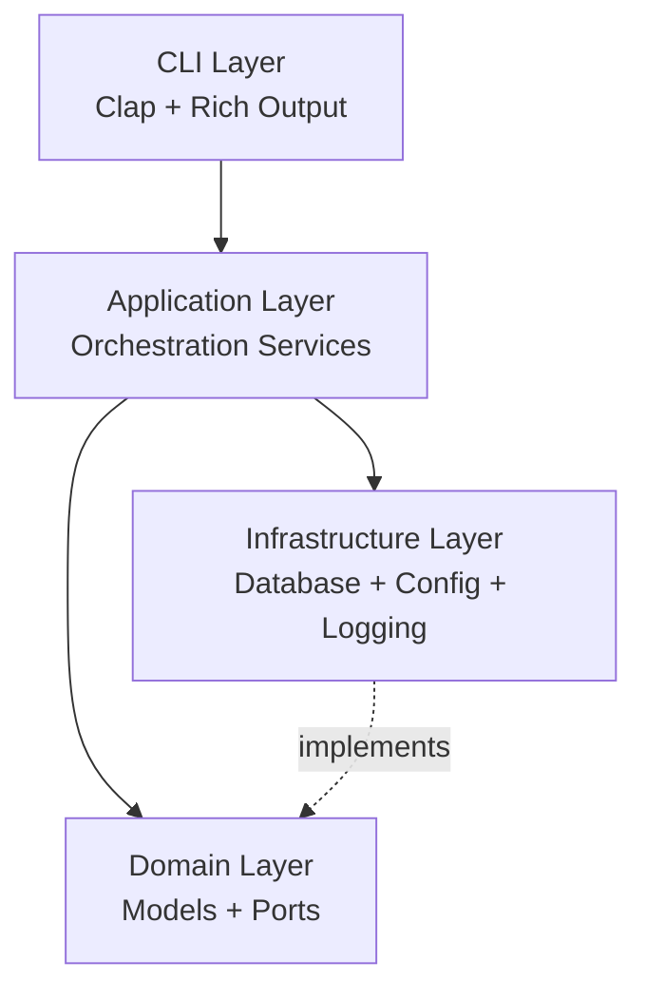

# Development Guide

This guide shows you how to set up a development environment for Abathur and contribute to the project. Whether you're fixing a bug, adding a feature, or improving documentation, this guide will help you get started.

## Prerequisites

Before setting up your development environment, ensure you have:

- **Rust 1.83 or higher** - Install via [rustup](https://rustup.rs/)
- **Git** - For version control
- **SQLite** - Usually pre-installed on macOS and Linux
- **A GitHub account** - For forking and submitting pull requests

!!! info "Development vs. User Installation"
    This guide is for contributors working on Abathur itself. If you just want to use Abathur, see the [Installation Guide](../getting-started/installation.md).

## Development Environment Setup

### 1. Fork and Clone the Repository

Fork the repository on GitHub, then clone your fork:

```bash
# Clone your fork
git clone https://github.com/YOUR_USERNAME/abathur-swarm.git
cd abathur-swarm

# Add upstream remote to track the main repository
git remote add upstream https://github.com/odgrim/abathur-swarm.git
```

Verify your remotes:

```bash
git remote -v
```

**Expected Output**:
```
origin    https://github.com/YOUR_USERNAME/abathur-swarm.git (fetch)
origin    https://github.com/YOUR_USERNAME/abathur-swarm.git (push)
upstream  https://github.com/odgrim/abathur-swarm.git (fetch)
upstream  https://github.com/odgrim/abathur-swarm.git (push)
```

### 2. Install Rust Toolchain

If you don't have Rust installed:

```bash
# Install Rust via rustup
curl --proto '=https' --tlsv1.2 -sSf https://sh.rustup.rs | sh

# Source the environment
source $HOME/.cargo/env
```

Verify installation:

```bash
rustc --version
cargo --version
```

### 3. Install Development Tools

Install essential Rust development tools:

```bash
# Code formatter
rustup component add rustfmt

# Linter
rustup component add clippy

# Code coverage tool
cargo install cargo-tarpaulin
```

**Optional but recommended**:

```bash
# Benchmarking tool (already included in dev-dependencies)
# cargo install cargo-criterion

# Watch tool for automatic rebuilds
cargo install cargo-watch

# Documentation generator helper
cargo install cargo-edit
```

### 4. Build the Project

Build Abathur in debug mode (faster compilation, slower runtime):

```bash
cargo build
```

**Expected Output**:
```
   Compiling abathur-cli v0.1.0 (/path/to/abathur-swarm)
    Finished dev [unoptimized + debuginfo] target(s) in 1m 45s
```

!!! tip "Build Time"
    The first build may take 2-5 minutes as Cargo compiles all dependencies. Subsequent builds are much faster thanks to incremental compilation.

### 5. Run Tests

Verify everything works:

```bash
cargo test
```

**Expected Output**:
```
running 47 tests
test domain::models::tests::test_task_creation ... ok
test domain::models::tests::test_priority_ordering ... ok
...
test result: ok. 47 passed; 0 failed; 0 ignored; 0 measured; 0 filtered out
```

### 6. Set Up Your IDE

**Visual Studio Code** (Recommended):

Install these extensions:

1. **rust-analyzer** - Rust language support
2. **Even Better TOML** - TOML syntax highlighting
3. **CodeLLDB** - Debugging support (optional)

Add to `.vscode/settings.json`:

```json
{
  "rust-analyzer.checkOnSave.command": "clippy",
  "editor.formatOnSave": true,
  "[rust]": {
    "editor.defaultFormatter": "rust-lang.rust-analyzer"
  }
}
```

**IntelliJ IDEA / CLion**:

1. Install the Rust plugin
2. Enable rustfmt in **Settings → Languages & Frameworks → Rust → Rustfmt**
3. Enable clippy in **Settings → Languages & Frameworks → Rust → External Linters**

## Project Structure

Understanding the codebase organization helps you navigate and contribute effectively.

### Directory Layout

```
abathur-swarm/
├── src/                      # Source code
│   ├── main.rs              # CLI entry point
│   ├── lib.rs               # Library root
│   ├── cli/                 # CLI layer (commands, output)
│   │   ├── commands/        # Clap command implementations
│   │   └── output/          # Terminal formatting (tables, trees)
│   ├── domain/              # Domain models and business logic
│   │   ├── models/          # Task, Agent, ExecutionResult
│   │   └── ports/           # Trait interfaces (hexagonal ports)
│   ├── services/            # Service layer implementations
│   ├── application/         # Application orchestration services
│   └── infrastructure/      # External integrations
│       ├── database/        # SQLite repositories (sqlx)
│       ├── config/          # Configuration management (figment)
│       └── logging/         # Structured logging (tracing)
├── tests/                   # Integration tests
│   ├── cli/                 # CLI integration tests
│   ├── e2e/                 # End-to-end tests
│   └── helpers/             # Test utilities
├── benches/                 # Performance benchmarks
├── migrations/              # SQLite database migrations
├── docs/                    # MkDocs documentation
├── .abathur/                # Runtime directory (git-ignored)
├── Cargo.toml               # Project manifest
└── rustfmt.toml             # Code formatting rules
```

### Architecture Overview

Abathur follows **Clean Architecture** (Hexagonal Architecture) principles:



**Key Principles**:

1. **Domain Independence**: `domain/` has no dependencies on `infrastructure/`
2. **Dependency Inversion**: Infrastructure implements domain-defined traits (ports)
3. **Async-First**: All I/O uses `async`/`await` with Tokio runtime
4. **Type Safety**: Leverage Rust's type system for correctness

For detailed architecture documentation, see `src/domain/README.md` and `CONTRIBUTING.md`.

## Building from Source

### Debug Build

Fast compilation, includes debug symbols:

```bash
cargo build
```

Run without installing:

```bash
cargo run -- --help
cargo run -- task list
cargo run -- init
```

### Release Build

Optimized for performance:

```bash
cargo build --release
```

The binary is at `target/release/abathur`.

### Install Locally

Install the development version to your system:

```bash
cargo install --path .
```

This installs to `~/.cargo/bin/abathur`, allowing you to run `abathur` from anywhere.

## Running Tests

### All Tests

Run the complete test suite:

```bash
cargo test
```

### Unit Tests Only

Run tests in `src/` modules:

```bash
cargo test --lib
```

### Integration Tests Only

Run tests in `tests/`:

```bash
cargo test --test '*'
```

### Specific Test Module

```bash
# Test a specific module
cargo test domain::models

# Test a specific function
cargo test test_task_creation

# Test with pattern matching
cargo test task_
```

### Tests with Output

See `println!` and debug output:

```bash
cargo test -- --nocapture
cargo test -- --show-output
```

### Tests with Logging

Enable logging output in tests:

```bash
RUST_LOG=debug cargo test -- --nocapture
RUST_LOG=abathur::domain=trace cargo test test_task_creation -- --nocapture
```

### Property-Based Tests

Run property tests with more cases:

```bash
# Default (256 cases)
cargo test property_

# More cases for thorough testing
PROPTEST_CASES=10000 cargo test property_
```

### Code Coverage

Generate coverage reports with cargo-tarpaulin:

```bash
# Generate HTML report
cargo tarpaulin --all-features --workspace --timeout 120 --out Html

# Open report
open tarpaulin-report.html
```

**Target Coverage**:
- **New code**: 80% minimum
- **Domain layer**: 90%+ recommended
- **Critical paths**: 100% (task scheduling, dependency resolution)

## Code Style Guidelines

### Formatting

Abathur uses `rustfmt` with custom configuration (see `rustfmt.toml`):

```bash
# Format all code
cargo fmt

# Check formatting without making changes
cargo fmt --check
```

**Key Formatting Rules**:
- **Max line width**: 100 characters
- **Indent**: 4 spaces (no tabs)
- **Imports**: Grouped (std, external, crate)
- **Comments**: Wrapped at 100 characters

### Linting

Run Clippy to catch common mistakes:

```bash
# Run clippy
cargo clippy --all-targets --all-features

# Treat warnings as errors (required for CI)
cargo clippy --all-targets --all-features -- -D warnings
```

### Naming Conventions

Follow Rust conventions:

| Type | Convention | Example |
|------|------------|---------|
| Types (struct, enum, trait) | `PascalCase` | `TaskQueue`, `TaskStatus` |
| Functions, variables | `snake_case` | `calculate_priority()`, `max_retries` |
| Constants | `SCREAMING_SNAKE_CASE` | `MAX_CONCURRENT_AGENTS` |
| Lifetimes | `'lowercase` | `'a`, `'static` |
| Type parameters | Single uppercase | `T`, `E`, `R` |

### Documentation

Document all public APIs with doc comments:

```rust
/// Represents a task in the execution queue.
///
/// Tasks are the fundamental unit of work in Abathur. Each task has a unique
/// identifier, priority, status, and optional dependencies on other tasks.
///
/// # Examples
///
/// ```
/// use abathur_cli::domain::Task;
///
/// let task = Task::new("Implement authentication", 8);
/// assert_eq!(task.priority(), 8);
/// ```
pub struct Task {
    // fields...
}
```

**Documentation Standards**:
- Use `///` for item documentation
- Use `//!` for module documentation
- Include examples for complex APIs
- Document panics, errors, and safety requirements

### Error Handling

Use `thiserror` for domain errors:

```rust
use thiserror::Error;

#[derive(Error, Debug)]
pub enum TaskError {
    #[error("Task not found: {task_id}")]
    NotFound { task_id: String },

    #[error("Invalid priority: {0} (must be 0-10)")]
    InvalidPriority(u8),

    #[error("Circular dependency detected: {0}")]
    CircularDependency(String),
}
```

Use `anyhow` for application errors:

```rust
use anyhow::{Context, Result};

pub async fn load_config(path: &Path) -> Result<Config> {
    let contents = tokio::fs::read_to_string(path)
        .await
        .context(format!("Failed to read config from {}", path.display()))?;

    serde_yaml::from_str(&contents)
        .context("Failed to parse YAML config")
}
```

### Async Code Style

```rust
// ✅ Good: Use async/await
async fn process_task(task: &Task) -> Result<ExecutionResult> {
    let agent = spawn_agent(&task.agent_type).await?;
    let result = agent.execute(task).await?;
    save_result(&result).await?;
    Ok(result)
}

// ❌ Avoid: Futures combinators (less readable)
fn process_task_bad(task: &Task) -> impl Future<Output = Result<ExecutionResult>> {
    spawn_agent(&task.agent_type)
        .and_then(|agent| agent.execute(task))
        .and_then(|result| save_result(&result).map(|_| result))
}
```

Use `#[instrument]` for tracing:

```rust
use tracing::instrument;

#[instrument(skip(repository), fields(task_id = %id))]
async fn fetch_task(repository: &dyn TaskRepository, id: &str) -> Result<Task> {
    repository.get_task(id).await
}
```

## Git Workflow

### Branching Strategy

Create feature branches from `main`:

```bash
# Sync with upstream
git fetch upstream
git checkout main
git merge upstream/main

# Create feature branch
git checkout -b feature/your-feature-name
```

**Branch Naming**:
- Features: `feature/add-user-authentication`
- Bug fixes: `fix/task-priority-calculation`
- Documentation: `docs/improve-installation-guide`
- Refactoring: `refactor/simplify-error-handling`

### Making Changes

1. **Make your changes** in small, focused commits
2. **Format code**: `cargo fmt`
3. **Run linter**: `cargo clippy --all-targets --all-features -- -D warnings`
4. **Run tests**: `cargo test --all-features`
5. **Add tests** for new functionality

### Commit Messages

Follow conventional commit format:

```
<type>(<scope>): <subject>

<body>

<footer>
```

**Example**:
```
feat(task-queue): add priority-based scheduling

Implement priority queue using binary heap for O(log n) insertion
and retrieval. Tasks with higher priority are executed first.

Resolves #42
```

**Types**:
- `feat`: New feature
- `fix`: Bug fix
- `docs`: Documentation changes
- `refactor`: Code refactoring
- `test`: Adding or updating tests
- `perf`: Performance improvements
- `chore`: Maintenance tasks

**Guidelines**:
- First line: 50 characters or less
- Body: Wrap at 72 characters
- Explain "why" not "what" (code shows what)
- Reference issues: `Fixes #123`, `Resolves #456`

### Keeping Your Branch Updated

Regularly sync with upstream:

```bash
# Fetch upstream changes
git fetch upstream

# Rebase your branch on upstream/main
git rebase upstream/main

# Force push to your fork (if already pushed)
git push origin feature/your-feature-name --force-with-lease
```

!!! warning "Force Push Safety"
    Use `--force-with-lease` instead of `--force` to avoid overwriting others' work.

## Pull Request Process

### Before Submitting

Run the complete pre-submission checklist:

```bash
# Format code
cargo fmt --check

# Run linter (no warnings)
cargo clippy --all-targets --all-features -- -D warnings

# Run all tests
cargo test --all-features

# Build release version
cargo build --release
```

All checks must pass before submitting.

### Creating the Pull Request

1. **Push your branch** to your fork:
   ```bash
   git push origin feature/your-feature-name
   ```

2. **Open a pull request** on GitHub from your fork to `upstream/main`

3. **Fill out the PR template**:

```markdown
## Summary
Brief description of the changes in 1-2 sentences.

## Motivation
Why are these changes needed? What problem do they solve?

## Changes
- Added priority-based task scheduling
- Implemented binary heap for efficient queue operations
- Added unit tests for priority ordering
- Updated documentation with scheduling algorithm details

## Testing
- All existing tests pass
- Added 8 new unit tests for priority queue operations
- Verified with property tests (10,000 cases)
- Manual testing with CLI commands

## Breaking Changes
- None
OR
- Changed `Task::new()` signature to include priority parameter
- Migration guide: [link to migration docs]

## Checklist
- [x] Tests pass (`cargo test`)
- [x] Linter passes (`cargo clippy -- -D warnings`)
- [x] Code is formatted (`cargo fmt`)
- [x] Documentation updated
- [x] CHANGELOG.md updated (if applicable)
```

### Review Process

**What to expect**:

1. **Automated CI checks** run on your PR
2. **Code review** by maintainers (usually within 2-3 days)
3. **Discussion** about implementation details
4. **Requested changes** (if needed)
5. **Approval and merge** once all requirements are met

**Responding to feedback**:

```bash
# Make requested changes
git add .
git commit -m "Address review feedback: improve error messages"

# Push updates
git push origin feature/your-feature-name
```

The PR will automatically update.

### Merge Requirements

Before merging, your PR must:

- ✅ Pass all CI checks (tests, clippy, formatting)
- ✅ Have at least one maintainer approval
- ✅ Have adequate test coverage (80%+ for new code)
- ✅ Include documentation for public APIs
- ✅ Follow code style guidelines
- ✅ Have a clear commit history

### After Merge

Once merged:

```bash
# Switch to main branch
git checkout main

# Pull the merged changes
git pull upstream main

# Delete your feature branch
git branch -d feature/your-feature-name
git push origin --delete feature/your-feature-name
```

## Common Development Tasks

### Running Locally with Logging

```bash
# Info level
RUST_LOG=info cargo run -- task list

# Debug level
RUST_LOG=debug cargo run -- init

# Trace level for specific module
RUST_LOG=abathur_cli::domain::task=trace cargo run -- task show <id>
```

### Generating Documentation

```bash
# Generate and open API docs
cargo doc --open

# Include private items
cargo doc --document-private-items --open
```

### Running Benchmarks

```bash
# Run all benchmarks
cargo bench

# Run specific benchmark
cargo bench task_queue

# Save baseline for comparison
cargo bench -- --save-baseline main

# Compare against baseline
cargo bench -- --baseline main
```

### Database Migrations

```bash
# Create new migration
sqlx migrate add create_tasks_table

# Run migrations
cargo sqlx migrate run

# Revert last migration
cargo sqlx migrate revert
```

### Debugging

**Using rust-gdb** (Linux):

```bash
# Build with debug symbols
cargo build

# Debug with gdb
rust-gdb target/debug/abathur
(gdb) run task list
(gdb) backtrace
```

**Using rust-lldb** (macOS):

```bash
rust-lldb target/debug/abathur
(lldb) run task list
(lldb) bt
```

**VS Code Debugging**:

Add to `.vscode/launch.json`:

```json
{
  "version": "0.2.0",
  "configurations": [
    {
      "type": "lldb",
      "request": "launch",
      "name": "Debug Abathur",
      "cargo": {
        "args": ["build", "--bin=abathur"],
        "filter": {
          "name": "abathur",
          "kind": "bin"
        }
      },
      "args": ["task", "list"],
      "cwd": "${workspaceFolder}"
    }
  ]
}
```

## Review Process

### What Reviewers Look For

**Code Quality**:
- Follows Rust idioms and conventions
- Properly handles errors
- Clear, self-documenting code
- Appropriate comments for complex logic

**Testing**:
- Adequate test coverage
- Tests cover edge cases
- Property tests for invariants
- Integration tests for workflows

**Documentation**:
- Public APIs documented
- Examples included
- Architecture decisions explained
- Breaking changes noted

**Performance**:
- No obvious performance regressions
- Efficient algorithms and data structures
- Benchmarks for performance-critical code

### Review Timeline

- **Initial review**: 2-3 business days
- **Follow-up review**: 1-2 business days
- **Emergency fixes**: Same day

If your PR hasn't been reviewed after 5 days, feel free to ping maintainers.

## Getting Help

### Resources

- **[Architecture Guide](../explanation/architecture.md)** - System design and patterns
- **[API Documentation](https://docs.rs/abathur-cli)** - Generated API docs
- **[Test Suite Summary](../../tests/TEST_SUITE_SUMMARY.md)** - Testing guide

### Communication Channels

- **Bug reports**: [GitHub Issues](https://github.com/odgrim/abathur-swarm/issues) with `bug` label
- **Feature requests**: [GitHub Issues](https://github.com/odgrim/abathur-swarm/issues) with `enhancement` label
- **Questions**: [GitHub Discussions](https://github.com/odgrim/abathur-swarm/discussions)
- **Security issues**: Email maintainers directly (see SECURITY.md)

### Debugging Tips

**Issue: Tests fail on your machine but pass in CI**

Check:
- Rust version matches CI (`rustup update stable`)
- Clean build: `cargo clean && cargo test`
- Check for timing-dependent tests

**Issue: Slow compilation**

Solutions:
- Use `cargo build` (debug) instead of `cargo build --release`
- Install `sccache`: `cargo install sccache && export RUSTC_WRAPPER=sccache`
- Use `cargo check` for faster feedback

**Issue: Clippy warnings**

Run with auto-fix:
```bash
cargo clippy --all-targets --all-features --fix
```

## Related Documentation

- **[Installation Guide](../getting-started/installation.md)** - Installing Abathur
- **[CLI Reference](../reference/cli-commands.md)** - Command-line interface
- **[Architecture Explanation](../explanation/architecture.md)** - Design principles
- **[Testing Guide](testing.md)** - Comprehensive testing documentation

---

**Estimated Reading Time**: 20 minutes
**Prerequisites**: Basic Rust knowledge, Git experience
[Previous: Contributing Overview](overview.md) | [Next: Testing Guide](testing.md)
