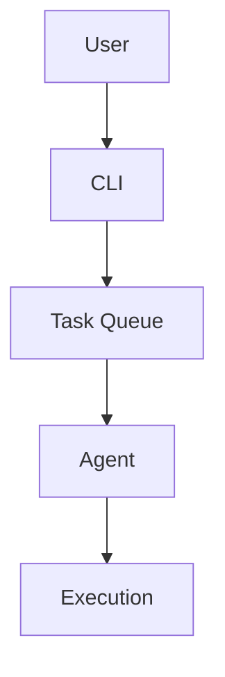

# Style Guide

This guide defines the coding standards, documentation conventions, and contribution practices for Abathur.

## Code Style

### Rust Formatting

Abathur uses `rustfmt` with default settings for consistent code formatting.

#### Running rustfmt

```bash
# Format all code
cargo fmt

# Check formatting without modifying files
cargo fmt --check

# Format specific file
rustfmt src/domain/models/task.rs
```

#### Configuration

Use the default `rustfmt` configuration. If project-specific settings are needed, they will be in `rustfmt.toml`:

```toml
# rustfmt.toml (default settings)
edition = "2024"
max_width = 100
use_small_heuristics = "Default"
```

### Linting with Clippy

Run `clippy` to catch common mistakes and enforce Rust idioms.

#### Running Clippy

```bash
# Run clippy on all targets
cargo clippy --all-targets --all-features

# Treat warnings as errors (CI requirement)
cargo clippy --all-targets --all-features -- -D warnings

# Run clippy with automatic fixes
cargo clippy --fix --all-targets --all-features
```

#### Common Clippy Fixes

```rust
// Bad: unnecessary clone
let s = String::from("hello");
let s2 = s.clone();
println!("{}", s);  // s is still available

// Good: use reference
let s = String::from("hello");
println!("{}", s);

// Bad: explicit return
fn add(a: i32, b: i32) -> i32 {
    return a + b;
}

// Good: implicit return
fn add(a: i32, b: i32) -> i32 {
    a + b
}

// Bad: unnecessary Ok wrapping
fn process() -> Result<(), Error> {
    return Ok(());
}

// Good: use Ok directly
fn process() -> Result<(), Error> {
    Ok(())
}
```

### Naming Conventions

Follow Rust naming conventions:

| Item | Convention | Example |
|------|-----------|---------|
| Modules | `snake_case` | `task_queue`, `domain` |
| Types | `PascalCase` | `TaskQueue`, `AgentType` |
| Traits | `PascalCase` | `Repository`, `TaskExecutor` |
| Functions | `snake_case` | `create_task`, `get_by_id` |
| Variables | `snake_case` | `task_id`, `max_retries` |
| Constants | `SCREAMING_SNAKE_CASE` | `MAX_PRIORITY`, `DEFAULT_TIMEOUT` |
| Type parameters | `PascalCase` (single letter for simple) | `T`, `E`, `TaskType` |

#### Examples

```rust
// Good naming
const MAX_CONCURRENT_AGENTS: usize = 10;

struct TaskQueue {
    pending_tasks: Vec<Task>,
    max_priority: u8,
}

trait TaskRepository {
    async fn get_by_id(&self, id: Uuid) -> Result<Option<Task>>;
    async fn list_pending(&self) -> Result<Vec<Task>>;
}

impl TaskRepository for SqliteTaskRepository {
    async fn get_by_id(&self, task_id: Uuid) -> Result<Option<Task>> {
        // Implementation
    }
}

fn calculate_priority_score(base_priority: u8, urgency_factor: f64) -> u8 {
    // Implementation
}
```

### Code Organization

#### Module Structure

```rust
// src/domain/models/task.rs
use uuid::Uuid;
use chrono::{DateTime, Utc};

// Re-exports at top
pub use self::status::TaskStatus;
pub use self::priority::Priority;

// Public types
#[derive(Debug, Clone, PartialEq)]
pub struct Task {
    pub id: Uuid,
    pub summary: String,
    pub description: String,
    pub status: TaskStatus,
}

// Public implementation
impl Task {
    pub fn new(id: Uuid, summary: String, description: String) -> Self {
        // Implementation
    }
}

// Private helper functions
fn validate_summary(summary: &str) -> bool {
    !summary.is_empty() && summary.len() <= 500
}

// Nested modules
mod status;
mod priority;

// Tests at end
#[cfg(test)]
mod tests {
    use super::*;

    #[test]
    fn test_task_creation() {
        // Test implementation
    }
}
```

#### Import Organization

Group imports in this order:

1. Standard library (`std`, `core`)
2. External crates
3. Internal crates (`crate::`)
4. Module imports (`super::`, `self::`)

```rust
// 1. Standard library
use std::collections::HashMap;
use std::sync::Arc;

// 2. External crates
use anyhow::{Context, Result};
use sqlx::SqlitePool;
use tokio::sync::RwLock;
use uuid::Uuid;

// 3. Internal crate imports
use crate::domain::models::{Task, TaskStatus};
use crate::domain::ports::TaskRepository;

// 4. Module imports
use super::DatabaseError;
```

### Error Handling

Use `thiserror` for custom errors and `anyhow` for application-level errors.

#### Defining Error Types

```rust
use thiserror::Error;

#[derive(Error, Debug)]
pub enum TaskError {
    #[error("Task not found: {0}")]
    NotFound(Uuid),

    #[error("Invalid priority: {0} (must be 0-10)")]
    InvalidPriority(u8),

    #[error("Circular dependency detected: {0} -> {1}")]
    CircularDependency(Uuid, Uuid),

    #[error("Database error: {0}")]
    Database(#[from] sqlx::Error),
}
```

#### Using Result Types

```rust
// Domain layer: use custom error types
pub async fn get_task(&self, id: Uuid) -> Result<Task, TaskError> {
    self.repository
        .get_by_id(id)
        .await?
        .ok_or(TaskError::NotFound(id))
}

// Application layer: use anyhow for context
pub async fn process_task(&self, id: Uuid) -> anyhow::Result<()> {
    let task = self.repository
        .get_by_id(id)
        .await
        .context("Failed to retrieve task")?
        .context(format!("Task not found: {}", id))?;

    self.executor
        .execute(&task)
        .await
        .context("Failed to execute task")?;

    Ok(())
}
```

### Documentation Comments

Use doc comments (`///`) for public APIs.

#### Function Documentation

```rust
/// Retrieves a task by its unique identifier.
///
/// # Arguments
///
/// * `id` - The UUID of the task to retrieve
///
/// # Returns
///
/// Returns `Ok(Some(Task))` if found, `Ok(None)` if not found,
/// or `Err` if a database error occurs.
///
/// # Examples
///
/// ```
/// use uuid::Uuid;
///
/// # async fn example(repo: &TaskRepository) -> Result<()> {
/// let task_id = Uuid::new_v4();
/// let task = repo.get_by_id(task_id).await?;
/// # Ok(())
/// # }
/// ```
///
/// # Errors
///
/// This function will return an error if:
/// - The database connection fails
/// - The query execution fails
pub async fn get_by_id(&self, id: Uuid) -> Result<Option<Task>> {
    // Implementation
}
```

#### Type Documentation

```rust
/// Represents a task in the orchestration system.
///
/// Tasks are the fundamental unit of work, containing all information
/// needed for execution by specialized agents.
///
/// # Examples
///
/// ```
/// use abathur::domain::Task;
/// use uuid::Uuid;
///
/// let task = Task::new(
///     Uuid::new_v4(),
///     "Implement feature X".to_string(),
///     "Detailed description...".to_string(),
/// );
/// ```
#[derive(Debug, Clone, PartialEq)]
pub struct Task {
    /// Unique identifier for the task
    pub id: Uuid,

    /// Brief summary (max 500 characters)
    pub summary: String,

    /// Detailed task description
    pub description: String,

    /// Current execution status
    pub status: TaskStatus,
}
```

## Code Review Checklist

### Before Submitting PR

- [ ] Code compiles without warnings: `cargo build`
- [ ] All tests pass: `cargo test --all-features`
- [ ] Code is formatted: `cargo fmt --check`
- [ ] Clippy passes: `cargo clippy --all-targets --all-features -- -D warnings`
- [ ] New functionality has tests (≥90% coverage for new code)
- [ ] Public APIs have documentation comments
- [ ] CHANGELOG.md updated (if applicable)
- [ ] No debug print statements (`println!`, `dbg!`) in final code

### Reviewer Checklist

- [ ] Code follows style guide
- [ ] Logic is clear and maintainable
- [ ] Error handling is appropriate
- [ ] Tests cover edge cases
- [ ] Documentation is accurate and complete
- [ ] No security vulnerabilities
- [ ] Performance implications considered
- [ ] Breaking changes are documented

## Documentation Style

Abathur documentation follows the [Diátaxis framework](https://diataxis.fr/) with four distinct types:

1. **Tutorials**: Learning-oriented, hands-on guides
2. **How-To Guides**: Problem-oriented recipes
3. **Reference**: Information-oriented technical details
4. **Explanation**: Understanding-oriented conceptual discussions

### Markdown Conventions

#### Headings

Use ATX-style headings with proper hierarchy:

```markdown
# Page Title (H1 - only one per page)

## Main Section (H2)

### Subsection (H3)

#### Detail Section (H4)
```

Never skip heading levels (e.g., H1 → H3).

#### Code Blocks

Always specify language for syntax highlighting:

````markdown
```rust
fn main() {
    println!("Hello, world!");
}
```

```bash
cargo build --release
```

```yaml
version: "1.0"
log_level: INFO
```
````

#### Lists

Use consistent list formatting:

```markdown
**Unordered lists** (use `-`):
- First item
- Second item
  - Nested item
  - Another nested item
- Third item

**Ordered lists**:
1. First step
2. Second step
   1. Sub-step
   2. Another sub-step
3. Third step
```

#### Links

Use descriptive link text:

```markdown
<!-- Good -->
See the [Task Queue Architecture](architecture.md#task-queue) for details.
Read about [dependency resolution](../explanation/dependencies.md).

<!-- Bad -->
Click [here](architecture.md) for more info.
See [this page](../explanation/dependencies.md).
```

### Code Examples

#### Complete and Runnable

```markdown
<!-- Good: Complete example -->
```rust
use abathur::domain::{Task, TaskStatus};
use uuid::Uuid;

fn main() {
    let task = Task::new(
        Uuid::new_v4(),
        "Example task".to_string(),
        "Description".to_string(),
    );
    println!("Created task: {}", task.id);
}
```

<!-- Bad: Incomplete example -->
```rust
let task = Task::new(...);
println!("{}", task.id);
```
```

#### Show Expected Output

```markdown
```bash
cargo test test_task_creation
```

**Expected Output**:
```
running 1 test
test domain::models::task::tests::test_task_creation ... ok

test result: ok. 1 passed; 0 failed; 0 ignored; 0 measured
```
```

### Admonitions

Use admonitions for important information:

```markdown
!!! note "Version Requirement"
    This feature requires Abathur 0.2.0 or higher.

!!! tip "Performance Optimization"
    Use `--release` flag for production builds.

!!! warning "Breaking Change"
    This API will change in version 0.3.0.

!!! danger "Data Loss Risk"
    This command permanently deletes all tasks.
```

**Admonition Types**:
- `note`: Additional context or information
- `tip`: Helpful suggestions or best practices
- `warning`: Important cautions or considerations
- `danger`: Critical warnings about destructive operations
- `example`: Code examples or use cases
- `info`: Implementation details or technical notes

### Mermaid Diagrams

Use Mermaid for architecture diagrams:

````markdown

````

**Diagram Types**:
- `graph`: Flow diagrams
- `sequenceDiagram`: Sequence interactions
- `stateDiagram-v2`: State machines
- `erDiagram`: Entity relationships

## Commit Messages

Follow [Conventional Commits](https://www.conventionalcommits.org/) format:

### Format

```
<type>(<scope>): <description>

[optional body]

[optional footer(s)]
```

### Types

| Type | Description | Example |
|------|-------------|---------|
| `feat` | New feature | `feat(cli): add task tree visualization` |
| `fix` | Bug fix | `fix(database): resolve connection pool leak` |
| `docs` | Documentation | `docs(contributing): add testing guidelines` |
| `style` | Code style (formatting) | `style: apply rustfmt to all files` |
| `refactor` | Code refactoring | `refactor(domain): simplify task creation` |
| `perf` | Performance improvement | `perf(queue): optimize priority calculation` |
| `test` | Add/update tests | `test(task): add property-based tests` |
| `chore` | Maintenance | `chore(deps): update sqlx to 0.8.2` |

### Examples

```bash
# Feature with scope
feat(swarm): implement concurrent agent execution

# Bug fix with description
fix(database): prevent race condition in task updates

Adds transaction isolation to ensure atomic updates
when multiple agents modify the same task.

Fixes #123

# Breaking change
feat(cli)!: change task list output format

BREAKING CHANGE: The `--format` flag now uses JSON by default.
Use `--format table` for the old behavior.

# Multiple changes
refactor(domain): improve task model ergonomics

- Add builder pattern for task creation
- Implement Display trait for TaskStatus
- Add convenience methods for status checks
```

## Pull Request Guidelines

### PR Title

Use conventional commit format:

```
feat(cli): add interactive task creation wizard
fix(database): resolve deadlock in concurrent access
docs(tutorial): add quickstart guide
```

### PR Description Template

```markdown
## Summary

Brief description of what this PR does.

## Changes

- Change 1
- Change 2
- Change 3

## Testing

- [ ] Unit tests added/updated
- [ ] Integration tests pass
- [ ] Manual testing performed

## Checklist

- [ ] Code compiles without warnings
- [ ] Tests pass (`cargo test --all-features`)
- [ ] Code formatted (`cargo fmt --check`)
- [ ] Clippy passes (`cargo clippy -- -D warnings`)
- [ ] Documentation updated
- [ ] CHANGELOG.md updated (if user-facing change)

## Related Issues

Fixes #123
Relates to #456
```

### Review Process

1. **Submit PR**: Create PR with descriptive title and complete description
2. **CI Checks**: All automated checks must pass
3. **Code Review**: At least one approval required
4. **Address Feedback**: Make requested changes
5. **Merge**: Squash and merge with clean commit message

### Merge Requirements

- [ ] All CI checks pass (tests, linting, formatting)
- [ ] At least one approving review
- [ ] No unresolved conversations
- [ ] Branch is up to date with main
- [ ] Commit message follows conventions

## Best Practices

### Performance

- Avoid unnecessary allocations
- Use `&str` instead of `String` when possible
- Prefer `Arc` over `Clone` for shared data
- Use `async`/`await` for I/O operations
- Profile before optimizing

### Security

- Validate all user input
- Use prepared statements for SQL queries (sqlx does this automatically)
- Sanitize file paths
- Never log sensitive data
- Use secure random generators (`Uuid::new_v4()`)

### Maintainability

- Keep functions small and focused
- Avoid deep nesting (use early returns)
- Use meaningful variable names
- Add comments for complex logic only
- Prefer composition over inheritance

### Testing

- Test public APIs, not implementation details
- Use property-based tests for invariants
- Mock external dependencies
- Aim for ≥80% coverage overall, ≥90% for new code
- Test error cases and edge conditions

## Related Documentation

- [Development Setup](development.md) - Setting up your environment
- [Testing Guidelines](testing.md) - How to test your code
- [Architecture](../explanation/architecture.md) - System design principles
- [Contributing Workflow](../../CONTRIBUTING.md) - Complete contribution process
