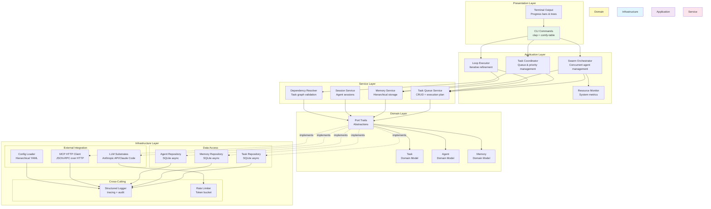
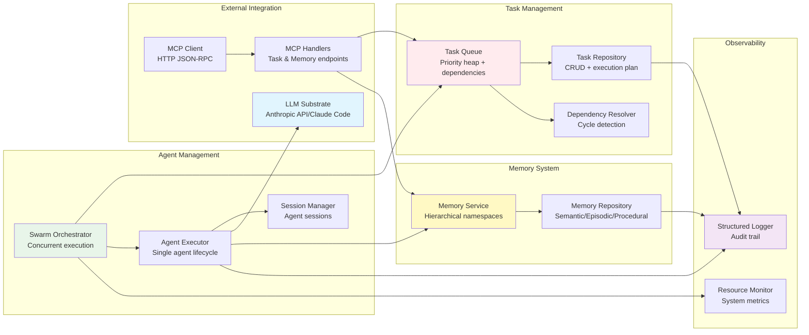
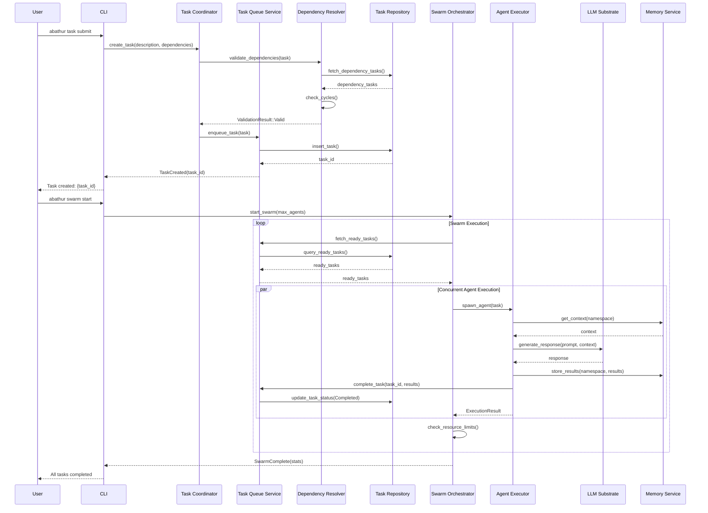
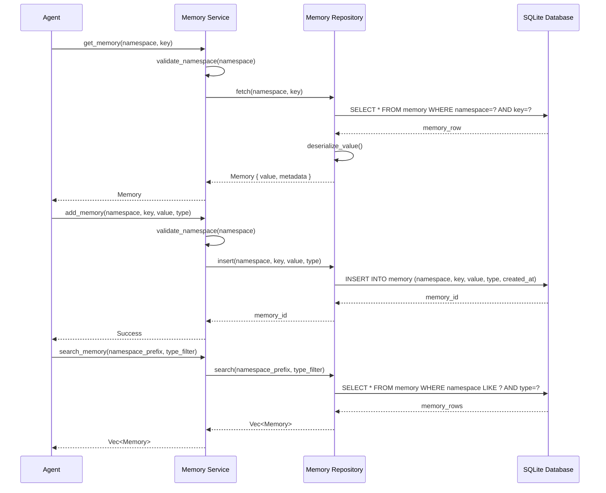
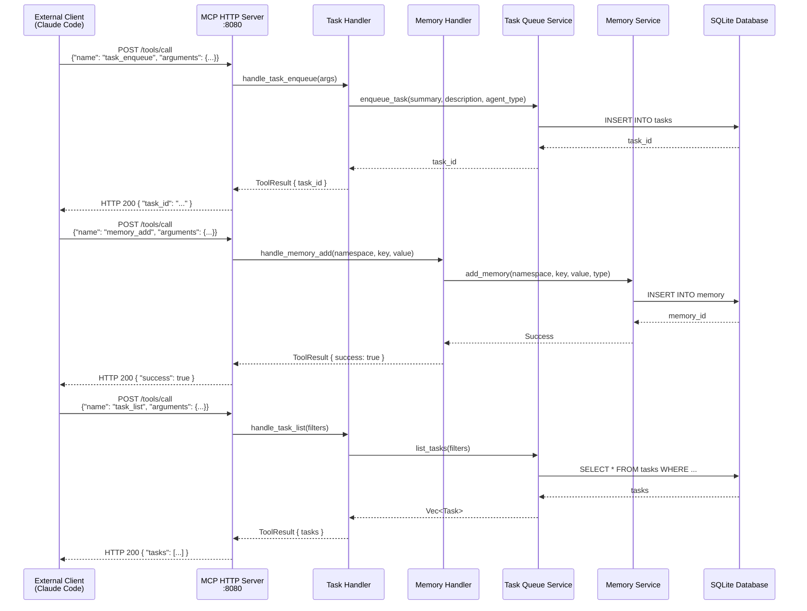
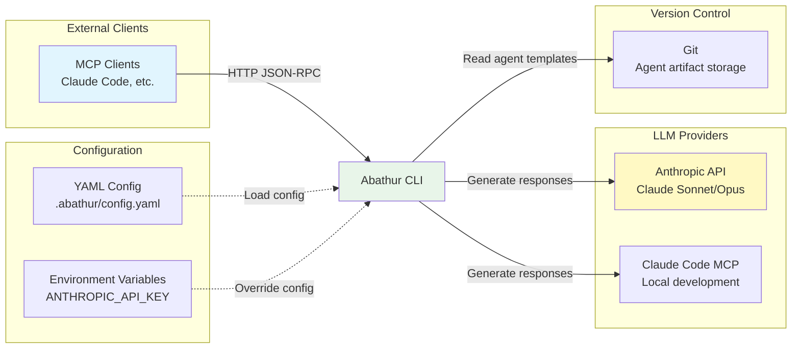
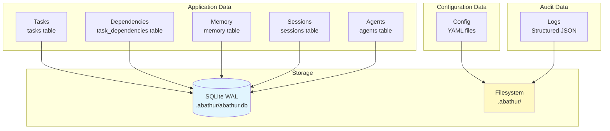

# System Architecture

This document explains Abathur's architecture, design decisions, and technical rationale.

## Overview

Abathur is an agentic swarm orchestration system built in Rust following **Clean Architecture** (also known as Hexagonal Architecture) principles. The system manages AI agent lifecycles, task scheduling with dependencies, hierarchical memory, and Model Context Protocol (MCP) integration.

**Core Capabilities:**

- **Task Queue Management**: Priority-based scheduling with dependency resolution
- **Concurrent Agent Swarms**: Multiple AI agents executing tasks simultaneously
- **Hierarchical Memory**: Semantic, episodic, and procedural memory with namespace organization
- **MCP Integration**: Bidirectional communication with MCP servers via HTTP
- **Iterative Refinement**: Multi-strategy convergence loops with checkpointing
- **Observability**: Structured logging, audit trails, and resource monitoring

## System Architecture

### Layered Architecture

Abathur follows a strict layered architecture with clear separation of concerns:



**Layer Responsibilities:**

- **Presentation Layer**: User interaction, command parsing, terminal output formatting
- **Application Layer**: Use case orchestration, workflow management, concurrency control
- **Service Layer**: Business logic coordination, transaction boundaries, domain orchestration
- **Domain Layer**: Pure business logic, domain models, port abstractions (no external dependencies)
- **Infrastructure Layer**: External integrations, database access, configuration, logging

### Dependency Flow

Dependencies flow **inward**: outer layers depend on inner layers, never the reverse. The Domain layer has zero external dependencies. Infrastructure implements Domain ports.

## Component Architecture

### Core Components



## Data Flow

### Task Execution Flow

This sequence diagram shows how a task flows through the system from submission to completion:



**Flow Stages:**

1. **Task Submission**: User submits task via CLI
2. **Validation**: Dependencies validated, cycles detected
3. **Queueing**: Task inserted into priority queue
4. **Scheduling**: Swarm orchestrator fetches ready tasks
5. **Execution**: Agents spawn concurrently, execute with LLM substrate
6. **Memory**: Context fetched/stored in hierarchical memory
7. **Completion**: Task status updated, results persisted

### Memory Access Flow



**Memory Types:**

- **Semantic**: Facts, knowledge, concepts (e.g., API specifications, architecture docs)
- **Episodic**: Events, experiences (e.g., task execution history, agent interactions)
- **Procedural**: How-to knowledge (e.g., workflows, best practices, patterns)

**Namespace Hierarchy:**

```
project/
├── task/{task_id}/
│   ├── context
│   ├── results
│   └── history
├── agent/{agent_type}/
│   ├── specialization
│   └── patterns
└── swarm/{swarm_id}/
    ├── coordination
    └── metrics
```

### MCP Integration Flow



**MCP Endpoints:**

- `task_enqueue`: Submit new task
- `task_get`: Fetch task by ID
- `task_list`: List tasks with filters
- `task_cancel`: Cancel task and dependents
- `task_queue_status`: Get queue statistics
- `task_execution_plan`: Get dependency execution order
- `memory_add`: Store memory entry
- `memory_get`: Fetch memory by namespace/key
- `memory_search`: Search memories by namespace prefix
- `memory_update`: Update existing memory
- `memory_delete`: Soft delete memory

## Technology Stack

### Language & Runtime

**Rust 2024 Edition**

*Why Rust?*

- **Type Safety**: Compile-time guarantees prevent entire classes of bugs
- **Concurrency**: Fearless concurrency with ownership system prevents data races
- **Performance**: Zero-cost abstractions, minimal runtime overhead
- **Async Runtime**: Tokio provides high-performance async/await
- **Ecosystem**: Excellent libraries for CLI, DB, HTTP, logging

*Trade-offs:*

- ✅ Memory safety without garbage collection
- ✅ Excellent performance for concurrent agent execution
- ✅ Strong type system catches errors at compile time
- ❌ Steeper learning curve than Python
- ❌ Longer compilation times
- ❌ Smaller AI/ML ecosystem compared to Python

### Database

**SQLite with WAL mode (via sqlx)**

*Why SQLite?*

- **Embedded**: No separate database server required
- **WAL Mode**: Write-Ahead Logging enables concurrent reads during writes
- **ACID**: Full transactional support
- **Zero Configuration**: Works out of the box
- **Async Support**: sqlx provides compile-time checked queries

*Trade-offs:*

- ✅ Zero operational overhead
- ✅ Fast local access
- ✅ File-based, easy backup
- ✅ Excellent for single-machine workloads
- ❌ Not suitable for distributed systems (future consideration)
- ❌ Limited horizontal scalability

**Schema Design:**

```sql
CREATE TABLE tasks (
    id TEXT PRIMARY KEY,
    summary TEXT,
    description TEXT NOT NULL,
    status TEXT NOT NULL,
    agent_type TEXT NOT NULL,
    parent_task_id TEXT,
    base_priority INTEGER NOT NULL,
    effective_priority REAL NOT NULL,
    dependency_type TEXT NOT NULL,
    created_at TEXT NOT NULL,
    updated_at TEXT NOT NULL,
    completed_at TEXT,
    FOREIGN KEY (parent_task_id) REFERENCES tasks(id)
);

CREATE TABLE task_dependencies (
    task_id TEXT NOT NULL,
    depends_on_task_id TEXT NOT NULL,
    PRIMARY KEY (task_id, depends_on_task_id),
    FOREIGN KEY (task_id) REFERENCES tasks(id),
    FOREIGN KEY (depends_on_task_id) REFERENCES tasks(id)
);

CREATE TABLE memory (
    namespace TEXT NOT NULL,
    key TEXT NOT NULL,
    value TEXT NOT NULL,
    memory_type TEXT NOT NULL,
    created_by TEXT NOT NULL,
    created_at TEXT NOT NULL,
    updated_at TEXT NOT NULL,
    deleted_at TEXT,
    PRIMARY KEY (namespace, key)
);
```

### HTTP Framework

**Axum + Tower**

*Why Axum?*

- **Tokio-native**: Deep integration with async runtime
- **Type-safe**: Compile-time verified extractors and handlers
- **Middleware**: Tower ecosystem for observability, CORS, rate limiting
- **Performance**: Minimal overhead, excellent throughput

### LLM Integration

**Dual Substrate Pattern**

Abathur supports two LLM substrate implementations:

1. **Anthropic API** (Direct HTTP): For production deployments
2. **Claude Code MCP** (Local development): For interactive development

*Why dual substrates?*

- ✅ Development flexibility: Test agents locally in Claude Code
- ✅ Production deployment: Direct API calls for lower latency
- ✅ Cost optimization: Choose substrate based on use case
- ✅ Vendor flexibility: Easy to add new LLM providers

**Substrate Trait:**

```rust
#[async_trait]
pub trait LLMSubstrate: Send + Sync {
    async fn generate_response(
        &self,
        prompt: &str,
        context: Option<&str>,
        model: &str,
    ) -> Result<String, DomainError>;

    fn substrate_type(&self) -> SubstrateType;
}
```

### CLI Framework

**clap 4.x (derive macros) + comfy-table**

*Why clap?*

- **Derive Macros**: Declarative command definitions
- **Auto-generated Help**: Consistent help text
- **Validation**: Built-in argument validation
- **Subcommands**: Natural command hierarchy

*Why comfy-table?*

- **Rich Formatting**: ANSI colors, borders, alignment
- **Unicode Support**: Box-drawing characters for trees
- **Dynamic Width**: Adapts to terminal size

### Logging & Observability

**tracing + tracing-subscriber**

*Why tracing?*

- **Structured Logging**: Key-value pairs, not string concatenation
- **Spans**: Track request lifecycles across async boundaries
- **Levels**: trace, debug, info, warn, error
- **Filtering**: Runtime configuration via `RUST_LOG`
- **JSON Output**: Machine-readable logs for analysis

**Audit Trail:**

All critical operations logged with:

- `task_id`: Task identifier
- `agent_id`: Agent identifier
- `operation`: Action performed
- `timestamp`: ISO 8601 timestamp
- `user`: Creator/updater

### Configuration

**figment (YAML + env)**

*Why figment?*

- **Hierarchical Merging**: Multiple config sources
- **Type Safety**: Deserialize into Rust structs
- **Environment Variables**: Override via `ABATHUR_*`
- **Validation**: Fail fast on invalid config

**Hierarchy (highest to lowest precedence):**

1. Environment variables: `ABATHUR_*`
2. Local overrides: `.abathur/local.yaml`
3. User config: `~/.abathur/config.yaml`
4. Template defaults: `.abathur/config.yaml`

## Design Decisions

### 1. Clean Architecture / Hexagonal Architecture

**Decision:** Strict layer separation with dependency inversion.

**Rationale:**

- **Testability**: Mock infrastructure layer, test domain/service logic in isolation
- **Flexibility**: Swap implementations (e.g., SQLite → PostgreSQL) without changing domain logic
- **Maintainability**: Changes in outer layers don't affect inner layers
- **Independence**: Domain layer has zero external dependencies

**Trade-offs:**

- ✅ Highly testable, maintainable codebase
- ✅ Easy to swap implementations (database, LLM provider, etc.)
- ✅ Domain logic remains pure and independent
- ❌ More upfront design effort
- ❌ More code (traits, adapters, implementations)
- ❌ Learning curve for developers unfamiliar with pattern

### 2. Async-First with Tokio

**Decision:** Fully asynchronous using Tokio runtime.

**Rationale:**

- **Concurrency**: Spawn hundreds of concurrent agents without thread overhead
- **Non-blocking I/O**: Database, HTTP, LLM calls don't block other tasks
- **Backpressure**: Semaphore-based concurrency control prevents resource exhaustion
- **Ecosystem**: Mature async ecosystem (sqlx, axum, reqwest, tracing)

**Trade-offs:**

- ✅ Excellent concurrency for I/O-bound workloads
- ✅ Low memory overhead per task
- ✅ Natural fit for agent orchestration
- ❌ Async rust has a learning curve
- ❌ Some dependencies don't support async
- ❌ Debugging async code can be challenging

### 3. Priority-Based Task Queue with Dependencies

**Decision:** Tasks have base priority + effective priority calculated from dependencies.

**Rationale:**

- **User Control**: Users can assign importance (base priority 0-10)
- **Smart Scheduling**: Critical path tasks automatically prioritized
- **Deadlock Prevention**: Cycle detection prevents dependency loops
- **Sequential/Parallel**: Support both execution models via dependency type

**Algorithm:**

```
effective_priority = base_priority + depth_in_dependency_tree * 0.1
```

**Trade-offs:**

- ✅ Flexible scheduling: manual + automatic priority
- ✅ Prevents deadlocks with cycle detection
- ✅ Supports complex workflows with mixed dependencies
- ❌ Priority calculation adds complexity
- ❌ Requires careful dependency graph design

### 4. Hierarchical Memory with Namespaces

**Decision:** Memory organized in hierarchical namespaces (e.g., `project/task/{task_id}/context`).

**Rationale:**

- **Organization**: Natural grouping by project, task, agent
- **Access Control**: Namespace-based permissions (future)
- **Search**: Prefix search for related memories
- **Isolation**: Agents can have private namespaces

**Trade-offs:**

- ✅ Intuitive organization
- ✅ Efficient prefix search
- ✅ Future-proof for access control
- ❌ Namespace design requires upfront planning
- ❌ Deeper namespaces = longer keys

### 5. MCP HTTP Server (not stdio)

**Decision:** MCP server uses HTTP JSON-RPC, not stdio transport.

**Rationale:**

- **Networking**: Remote access, load balancing, proxying
- **Language-agnostic**: Any HTTP client can integrate
- **Debugging**: Easy to test with curl, Postman
- **Scalability**: Multiple clients, stateless handlers

**Trade-offs:**

- ✅ Flexible deployment options
- ✅ Easy to integrate from any language
- ✅ Standard HTTP tooling (proxies, load balancers)
- ❌ More complex than stdio for local development
- ❌ Requires network configuration

### 6. Embedded SQLite (not PostgreSQL)

**Decision:** Use SQLite with WAL mode instead of PostgreSQL.

**Rationale:**

- **Simplicity**: Zero configuration, no database server
- **Performance**: Local file access is fast for single-machine workloads
- **Portability**: Database is a single file, easy to backup/restore
- **Development**: No Docker/services needed for development

**Trade-offs:**

- ✅ Zero operational overhead
- ✅ Excellent for single-machine use cases
- ✅ Fast for local access
- ❌ Not suitable for distributed systems (future limitation)
- ❌ WAL mode requires proper cleanup

**Future Consideration:** If distributed orchestration is needed, add PostgreSQL adapter via repository pattern.

## Scalability Considerations

### Current Architecture (Single Machine)

Abathur is optimized for **single-machine concurrency**:

- **Agents**: Concurrently execute up to configured limit (e.g., 10-100 agents)
- **Database**: SQLite WAL mode supports concurrent reads + single writer
- **Memory**: In-memory rate limiter, no shared state across processes

**Scalability Limits:**

- **Vertical Scaling**: Add CPU cores → spawn more agents
- **Agent Limit**: Anthropic API rate limits (tier-dependent)
- **Database**: SQLite WAL mode handles ~100K writes/second (sufficient)
- **Memory**: Limited by machine RAM

### Future Horizontal Scaling

To scale across multiple machines, consider:

1. **Distributed Task Queue**:
   - Replace SQLite with PostgreSQL
   - Add distributed locking (Redis, etcd)
   - Implement leader election for coordination

2. **Agent Distribution**:
   - Agent pool across multiple machines
   - Central coordinator assigns tasks to worker nodes
   - Shared state via distributed database

3. **Memory Distribution**:
   - Replace SQLite memory with Redis/DynamoDB
   - Namespace-based sharding
   - Eventual consistency model

4. **Load Balancing**:
   - Multiple MCP server instances behind load balancer
   - Sticky sessions for agent continuity
   - Horizontal pod autoscaling in Kubernetes

**Design Principle:** Current architecture uses repository pattern and port abstractions, making it straightforward to swap implementations for distributed deployment.

## Integration Points

### External Systems



**Integration Methods:**

- **Anthropic API**: Direct HTTP REST API calls with rate limiting
- **Claude Code**: MCP protocol (JSON-RPC over HTTP)
- **Git**: CLI commands for template repository management
- **External MCP Clients**: HTTP server on `:8080` with JSON-RPC endpoints

### Data Persistence



**Storage Locations:**

- `.abathur/abathur.db`: SQLite database (tasks, memory, sessions, agents)
- `.abathur/config.yaml`: Template configuration
- `.abathur/local.yaml`: User overrides
- `.abathur/logs/`: Structured logs
- `~/.abathur/`: User-level configuration

## Summary

Abathur's architecture prioritizes:

1. **Clean Architecture**: Testable, maintainable, flexible
2. **Type Safety**: Rust's type system prevents entire classes of bugs
3. **Concurrency**: Tokio async runtime for high-concurrency agent execution
4. **Observability**: Structured logging, audit trails, resource monitoring
5. **Extensibility**: Port abstractions make it easy to add new integrations
6. **Developer Experience**: Rich CLI output, comprehensive documentation

**Trade-offs:**

- Single-machine optimization (future: distributed scaling)
- Rust learning curve (benefit: safety + performance)
- More upfront design (benefit: long-term maintainability)

**Next Steps:**

- [Getting Started Guide](../getting-started/quickstart.md): Install and run Abathur
- [How-To Guides](../how-to/submit-task.md): Common operations
- [API Reference](../reference/cli-commands.md): Complete CLI documentation
