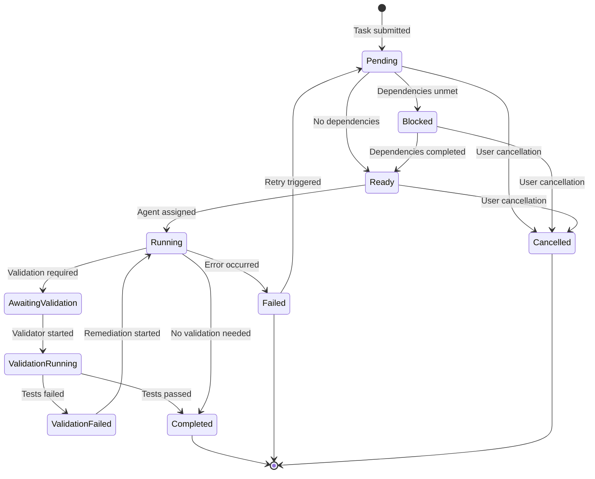

# Understanding the Task Queue System

The task queue is the central coordination mechanism in Abathur Swarm, responsible for orchestrating the execution of tasks submitted by users and agents. Rather than executing tasks immediately, the queue manages complex workflows involving dependencies, priorities, concurrency limits, and agent assignment.

## Overview

At its core, the task queue solves several coordination challenges:

- **When should a task execute?** (dependency resolution)
- **Which task should execute next?** (priority scheduling)
- **How many tasks can run simultaneously?** (concurrency control)
- **Which agent should execute a task?** (agent assignment)
- **What happens when tasks fail?** (error handling and retries)

Without a task queue, these concerns would need to be manually coordinated by the user, making complex multi-task workflows brittle and error-prone.

## The Problem: Why Not Simple Sequential Execution?

Consider implementing a feature that requires:

1. Gathering requirements
2. Designing the architecture
3. Implementing three independent components
4. Running tests
5. Deploying to production

Simple sequential execution would process these one-by-one, even though the three components could be implemented in parallel. The task queue enables:

- **Parallelism**: Multiple independent tasks execute concurrently
- **Dependency enforcement**: Tests don't run until implementation completes
- **Priority scheduling**: Critical tasks execute before less important ones
- **Resource management**: Prevents system overload from too many concurrent tasks

## Task Lifecycle

Tasks flow through a well-defined lifecycle from submission to completion. Understanding these states and transitions is essential to working with the queue effectively.



### Task States

#### **Pending**
Initial state when a task is first submitted. The system hasn't yet checked whether dependencies are met or whether the task can proceed.

**Transitions from Pending:**
- → `Ready`: All dependencies are completed (or no dependencies exist)
- → `Blocked`: One or more dependencies are not yet completed
- → `Cancelled`: User cancels the task before it starts

#### **Blocked**
The task cannot proceed because it depends on other tasks that haven't completed yet. This is a waiting state.

**Transitions from Blocked:**
- → `Ready`: All dependency tasks complete successfully
- → `Cancelled`: User cancels the waiting task

**Example Scenario**: Task B implements a feature that depends on Task A completing requirements gathering. While A is running, Task B remains `Blocked`.

#### **Ready**
All dependencies are met and the task is eligible for execution. It's waiting for an available agent to be assigned.

**Transitions from Ready:**
- → `Running`: An agent picks up the task and begins execution
- → `Cancelled`: User cancels before agent assignment

**Note**: Multiple tasks can be `Ready` simultaneously. The priority system determines execution order.

#### **Running**
An agent is actively executing the task. This is the only state where actual work happens.

**Transitions from Running:**
- → `Completed`: Task executes successfully (no validation required)
- → `AwaitingValidation`: Task completes but requires validation
- → `Failed`: Task encounters an error during execution

**Duration**: Tasks in this state are monitored for timeout. The `max_execution_timeout_seconds` field (default: 3600s) defines how long a task can run before timing out.

#### **AwaitingValidation**
Task execution completed, but validation is required before marking as complete. A validation task is being spawned.

**Transitions from AwaitingValidation:**
- → `ValidationRunning`: Validation task begins execution

**When used**: Tasks with `validation_requirement` set (e.g., code implementation tasks that need test validation).

#### **ValidationRunning**
A validation task is actively checking the completed work (running tests, checking contract compliance, etc.).

**Transitions from ValidationRunning:**
- → `Completed`: Validation passes
- → `ValidationFailed`: Validation finds issues

#### **ValidationFailed**
Validation detected problems with the completed work. Remediation is needed.

**Transitions from ValidationFailed:**
- → `Running`: A remediation task is created and starts fixing issues

**Remediation Cycle**: The system tracks `remediation_count` against `max_remediation_cycles` to prevent infinite fix-validate loops.

#### **Completed**
Final success state. The task executed successfully and (if required) passed validation.

**Characteristics:**
- Terminal state (no further transitions)
- Unblocks dependent tasks
- Triggers dependent task status updates (Blocked → Ready)
- `completed_at` timestamp is set

#### **Failed**
The task encountered an error during execution and could not complete.

**Transitions from Failed:**
- → `Pending`: Retry logic triggers (if `retry_count < max_retries`)
- → Terminal: No more retries available

**Error Handling**: The `error_message` field contains diagnostic information. Failed tasks do not unblock dependents.

#### **Cancelled**
The task was cancelled by a user or system process before completion.

**Characteristics:**
- Terminal state
- Can be cancelled from `Pending`, `Blocked`, or `Ready` states
- Cannot cancel from `Running`, `Completed`, or `Failed` states
- Dependent tasks remain blocked (cancelled tasks don't unblock dependents)

## Priority System

Not all tasks are equally important. The priority system determines execution order when multiple tasks are ready to run.

### Priority Levels (0-10)

Tasks are assigned a base priority from 0 (lowest) to 10 (highest):

| Priority | Use Case | Example |
|----------|----------|---------|
| 0-2 | Background tasks, cleanup, optional optimizations | "Refactor old code for readability" |
| 3-4 | Normal work items | "Add logging to authentication module" |
| 5 (default) | Standard feature work | "Implement user profile page" |
| 6-7 | Important features | "Fix security vulnerability" |
| 8-9 | High priority, time-sensitive | "Deploy critical hotfix" |
| 10 | Urgent, blocking work | "Restore production service" |

### Calculated Priority Formula

The system doesn't use the base priority alone. It calculates an effective priority using:

```
calculated_priority = base_priority + (dependency_depth × 0.5) + deadline_boost
```

#### Dependency Depth Boost

Tasks deeper in a dependency chain receive a priority boost to ensure leaf tasks (those with many dependents) complete first.

**Depth Calculation**: The maximum chain length from this task to any task with no dependents.

**Example Dependency Chain**:
```
Task A (depth=0) → Task B (depth=1) → Task C (depth=2)
```

If all have base priority 5:
- Task A: `calculated_priority = 5 + (0 × 0.5) = 5.0`
- Task B: `calculated_priority = 5 + (1 × 0.5) = 5.5`
- Task C: `calculated_priority = 5 + (2 × 0.5) = 6.0`

Task C executes first, ensuring the dependency chain progresses toward completion.

#### Deadline Boost

Tasks with approaching deadlines receive progressively higher priority boosts.

**Formula**:
```
ratio = (deadline - submitted_at - remaining_time) / (deadline - submitted_at)
deadline_boost = ratio × 3.0  (max 3.0)
```

**Scenarios**:

- **Deadline passed**: Maximum boost (+3.0)
- **50% time elapsed**: Moderate boost (+1.5)
- **10% time elapsed**: Small boost (+0.3)
- **No deadline**: No boost (0.0)

**Example**:
```
Base priority: 5
Dependency depth: 2
Deadline: 80% of time elapsed

calculated_priority = 5 + (2 × 0.5) + (0.8 × 3.0) = 8.4
```

### Priority Scheduling Algorithm

When selecting the next task to execute:

1. Filter tasks by status (`Ready` only)
2. Calculate effective priority for each
3. Sort by `calculated_priority` (highest first)
4. Within same priority, use FIFO order (oldest first)
5. Return the highest priority task

!!! tip "Priority Best Practice"
    Use base priorities sparingly. Let the dependency depth boost naturally prioritize leaf tasks. Reserve high base priorities (8-10) for truly urgent work.

## Dependency Management

Dependencies model "happens-before" relationships between tasks. Task B depending on Task A means "Task B cannot start until Task A completes successfully."

### Dependency Types

#### Sequential Dependencies

The most common type. Task B depends on Task A completing.

```rust
let task_a = Task::new("Gather requirements", "...");
let mut task_b = Task::new("Design architecture", "...");

task_b.set_dependencies(
    vec![task_a.id],
    DependencyType::Sequential,
    depth
);
```

**Execution Order**: A → B

**Use Case**: Linear workflows where each step builds on the previous one.

#### Parallel Dependencies

Task C depends on both Task A **and** Task B completing (AND logic).

```rust
let task_a = Task::new("Implement API", "...");
let task_b = Task::new("Implement UI", "...");
let mut task_c = Task::new("Integration tests", "...");

task_c.set_dependencies(
    vec![task_a.id, task_b.id],
    DependencyType::Parallel,
    depth
);
```

**Execution Order**: A and B execute concurrently → C executes after both complete

**Use Case**: Convergence points where multiple parallel workstreams must complete before proceeding.

### Dependency Graph Resolution

The system uses topological sorting (Kahn's algorithm) to determine a valid execution order.

**Example Dependency Graph**:
```
     A
    / \
   B   C
    \ /
     D
```

**Valid Execution Orders**:
- A → B → C → D
- A → C → B → D

Both orders respect dependencies. The priority system selects between valid orders.

### Circular Dependency Detection

Circular dependencies create deadlocks where tasks wait on each other indefinitely. The system detects these using depth-first search (DFS) with graph coloring.

**Three-Color Algorithm**:
- **White**: Unvisited node
- **Gray**: Currently visiting (on the DFS path)
- **Black**: Fully visited

**Cycle Detection**: If DFS encounters a gray node, a cycle exists.

**Example Circular Dependency**:
```
A → B → C → A  (INVALID)
```

!!! danger "Circular Dependency Error"
    Tasks with circular dependencies are rejected during submission with error: `"Circular dependency detected: [task_ids]"`

### Dependency Validation

When a task is submitted, the system validates:

1. **Existence**: All dependency task IDs must exist
2. **Acyclicity**: No cycles in the dependency graph
3. **Depth Calculation**: Computes dependency depth for priority boost

**Validation Failure**: Task submission is rejected with a descriptive error message.

### Dependency Status Updates

When a task completes:

1. System identifies all tasks depending on the completed task
2. Checks each dependent's remaining dependencies
3. If all dependencies are met: `Blocked → Ready`
4. Recalculates priorities for affected tasks
5. Updates the ready queue

This cascading status update ensures tasks become ready as soon as they can execute.

## Concurrency Control

Unlimited concurrent task execution would overwhelm system resources. The task queue limits concurrency to maintain stability and performance.

### Semaphore-Based Limiting

The system uses a tokio semaphore to enforce concurrency limits.

```rust
// Configuration
max_concurrent_tasks: 10

// Semaphore permits
let semaphore = Arc::new(Semaphore::new(config.max_concurrent_tasks));

// Before starting a task
let _permit = semaphore.acquire().await?;
// Task executes while holding permit
// Permit released automatically when dropped
```

**How It Works**:
1. Semaphore initialized with N permits (e.g., 10)
2. Each task execution acquires a permit
3. If no permits available, task waits
4. Task releases permit when complete (success or failure)
5. Waiting tasks acquire permits in priority order

### Why Concurrency Limits Matter

**Without Limits**:
- Memory exhaustion from too many concurrent agents
- API rate limit violations (Claude API)
- System instability from resource contention
- Degraded performance from context switching

**With Limits**:
- Predictable resource usage
- Respects external API rate limits
- Stable system performance
- Graceful handling of workload spikes

### Configuring Concurrency

The `max_concurrent_tasks` setting balances throughput and resource usage:

| Concurrency | Best For | Tradeoffs |
|-------------|----------|-----------|
| 1-3 | Resource-constrained systems, API rate limits | Low throughput, high safety |
| 4-10 (default) | General purpose usage | Balanced throughput and stability |
| 11-20 | High-end systems, large workloads | High throughput, increased resource usage |
| 20+ | Enterprise deployments | Maximum throughput, requires significant resources |

!!! warning "Concurrency and API Limits"
    Consider external API rate limits when setting concurrency. Claude API has request-per-minute limits that may constrain effective concurrency.

## Agent Assignment

When a task transitions from `Ready` to `Running`, the system must select an appropriate agent to execute it.

### Agent Type Matching

Each task specifies an `agent_type` (e.g., `"rust-specialist"`, `"requirements-gatherer"`). The system matches this to available agent definitions.

**Agent Type Resolution**:
1. Check if agent type is registered in the swarm configuration
2. Verify agent has required capabilities
3. Ensure agent definition file exists (`.claude/agents/workers/{agent_type}.md`)

**Agent Not Found**: If the specified agent type doesn't exist, the task fails immediately with an error message.

### Agent Pool and Task Assignment

The orchestrator maintains an agent pool that manages concurrent agent workers:

```rust
// Simplified agent assignment flow
loop {
    // Get next ready task (highest priority)
    let task = coordinator.get_next_ready_task().await?;

    // Acquire concurrency permit
    let permit = semaphore.acquire().await?;

    // Spawn agent worker
    let agent = load_agent_definition(&task.agent_type)?;
    spawn_agent_worker(task, agent, permit).await?;
}
```

**Assignment Process**:
1. Query task queue for highest priority `Ready` task
2. Wait for available concurrency permit
3. Load agent definition for `task.agent_type`
4. Spawn tokio task to execute agent
5. Mark task as `Running`
6. Release permit when complete

### Agent Availability

The system doesn't currently track per-agent-type concurrency limits. All agents share the global `max_concurrent_tasks` pool.

**Future Enhancement**: Per-agent-type limits could prevent one agent type from consuming all permits.

## Error Handling

Tasks can fail for many reasons: agent errors, timeouts, invalid input, or external API issues. The queue provides robust error handling mechanisms.

### Failure Scenarios

#### Execution Errors

Agent encounters an error during task execution (e.g., compilation failure, test failure, API error).

**Handling**:
1. Agent returns error result
2. Task transitions to `Failed`
3. `error_message` field stores diagnostic info
4. Retry logic evaluates if retry is possible

#### Timeout

Task exceeds `max_execution_timeout_seconds` (default: 3600s / 1 hour).

**Handling**:
1. System detects `started_at + timeout < now`
2. Agent execution is terminated
3. Task marked as `Failed` with timeout message
4. Retry logic triggered

!!! info "Timeout Monitoring"
    The orchestrator periodically checks running tasks for timeouts using the `is_timed_out()` method on task models.

#### Validation Failure

Task completes execution but fails validation (e.g., tests don't pass).

**Handling**:
1. Task transitions to `ValidationFailed`
2. Remediation task is created (if under `max_remediation_cycles`)
3. Remediation task attempts to fix issues
4. Validation re-runs after remediation

**Remediation Limit**: Default `max_remediation_cycles: 3` prevents infinite fix-validate loops.

### Retry Policy

Failed tasks can be retried automatically based on configuration.

**Retry Decision**:
```rust
if task.retry_count < task.max_retries {
    task.retry()?;  // Reset to Pending
} else {
    // Terminal failure
}
```

**Retry Configuration** (per task):
- `retry_count`: Current retry attempt (starts at 0)
- `max_retries`: Maximum retry attempts (default: 3)

**Retry Behavior**:
1. Increment `retry_count`
2. Reset status to `Pending`
3. Clear `error_message`, `started_at`, `completed_at`
4. Task re-enters the queue for another attempt

!!! tip "Retry Best Practices"
    - Use retries for transient failures (network issues, rate limits)
    - Don't retry for permanent failures (invalid input, missing files)
    - Implement exponential backoff for external API failures (future enhancement)

### Cancellation Propagation

When a task is cancelled, the system can optionally cancel dependent tasks.

**Cancellation Scenarios**:

**Scenario 1: Cancel Parent Task**
```
A (Cancelled) → B (remains Blocked) → C (remains Blocked)
```
Dependent tasks remain blocked but won't proceed (dependency never completes).

**Scenario 2: Cascade Cancellation** (future enhancement)
```
A (Cancelled) → B (Cancelled) → C (Cancelled)
```
Cancelling A cascades to all dependent tasks.

**Current Behavior**: Cancellation does not cascade. Dependent tasks remain blocked indefinitely.

### Error Message Storage

The `error_message` field (optional string) stores diagnostic information:

- Exception stack traces
- Compilation errors
- Test failure output
- Timeout notifications
- Agent-specific error details

**Example Error Messages**:
```
"Task timeout after 3600 seconds"
"Compilation failed: cannot find type `Foo` in this scope"
"Tests failed: 3 of 45 tests failed"
"API rate limit exceeded: 429 Too Many Requests"
```

## Memory Integration

The task queue integrates with Abathur's memory system for persistence and state management.

### Task Metadata Storage

Each task's complete state is stored in the SQLite database via the memory MCP server:

**Stored Fields**:
- Core identity: `id`, `summary`, `description`, `agent_type`
- Priority: `priority`, `calculated_priority`, `dependency_depth`
- Status: `status`, `submitted_at`, `started_at`, `completed_at`
- Dependencies: `dependencies`, `dependency_type`
- Error tracking: `error_message`, `retry_count`, `max_retries`
- Workflow: `parent_task_id`, `validation_task_id`, `workflow_state`
- Results: `input_data`, `result_data`

**Namespace Pattern**: `task:{task_id}:*`

### Result Persistence

Task outputs are stored in the `result_data` JSON field:

```json
{
  "execution_status": {
    "status": "SUCCESS",
    "agents_created": 2
  },
  "deliverables": {
    "files_modified": ["src/main.rs"],
    "tests_passed": 45
  }
}
```

**Use Cases**:
- Dependent tasks access parent task results
- Auditing and debugging task execution
- Metrics and analytics on task outcomes

### History Tracking

The database maintains a complete audit trail:

- All status transitions (via `last_updated_at` timestamps)
- Retry attempts (`retry_count`)
- Execution duration (`started_at` to `completed_at`)
- Workflow relationships (`parent_task_id`, child queries)

**Query Examples**:
```rust
// Find all tasks that depend on a specific task
task_queue.get_dependent_tasks(task_id).await?

// Get all children spawned by a parent task
task_queue.get_children_by_parent(parent_id).await?

// Get all failed tasks for retry analysis
task_queue.get_tasks_by_status(TaskStatus::Failed).await?
```

### Memory Cleanup

!!! warning "Task History Growth"
    Task metadata accumulates over time. Consider periodic cleanup of old completed/failed tasks to maintain database performance.

**Future Enhancement**: Implement task archival and cleanup policies (e.g., delete tasks older than 90 days).

## How It All Works Together

Let's walk through a complete example to see how all these components interact.

### Example Workflow: Implement a Feature

User submits a high-level task: "Add user authentication"

#### Phase 1: Requirements Gathering

**Task Submission**:
```
Task A: "Add user authentication"
- agent_type: requirements-gatherer
- priority: 5
- dependencies: none
```

**Queue Processing**:
1. Task created with status `Pending`
2. No dependencies → transition to `Ready`
3. Priority calculated: `5.0` (base only)
4. Task enters ready queue

**Agent Assignment**:
1. Orchestrator queries: `get_next_ready_task()`
2. Returns Task A (highest priority)
3. Acquires semaphore permit
4. Spawns requirements-gatherer agent
5. Task transitions to `Running`

**Agent Execution**:
1. Agent analyzes requirements
2. Spawns 3 child tasks (Task B, C, D)
3. Agent completes with results

**Completion**:
1. Task transitions to `Completed`
2. No dependents to unblock
3. Semaphore permit released

#### Phase 2: Parallel Implementation

**Child Tasks Created**:
```
Task B: "Implement authentication API"
- agent_type: rust-http-api-client-specialist
- priority: 5
- dependencies: [Task A]
- dependency_type: Sequential
- dependency_depth: 1

Task C: "Implement password hashing"
- agent_type: rust-specialist
- priority: 5
- dependencies: [Task A]
- dependency_type: Sequential
- dependency_depth: 1

Task D: "Add authentication database tables"
- agent_type: rust-sqlx-database-specialist
- priority: 5
- dependencies: [Task A]
- dependency_type: Sequential
- dependency_depth: 1
```

**Queue Processing**:
1. All three tasks created with status `Pending`
2. Task A is `Completed` (dependency met)
3. All three transition to `Ready`
4. Priorities calculated: `5.0 + (1 × 0.5) = 5.5`

**Concurrent Execution**:
1. Orchestrator pulls Task B (first in ready queue)
2. Acquires permit (1 of 10 used)
3. Spawns rust-http-api-client-specialist
4. Task B → `Running`

5. Orchestrator pulls Task C
6. Acquires permit (2 of 10 used)
7. Spawns rust-specialist
8. Task C → `Running`

9. Orchestrator pulls Task D
10. Acquires permit (3 of 10 used)
11. Spawns rust-sqlx-database-specialist
12. Task D → `Running`

**All three tasks execute in parallel**, limited by available concurrency permits.

#### Phase 3: Integration Testing

**Integration Task**:
```
Task E: "Integration tests for authentication"
- agent_type: rust-testing-specialist
- priority: 5
- dependencies: [Task B, Task C, Task D]
- dependency_type: Parallel
- dependency_depth: 2
```

**Queue Processing**:
1. Task E created with status `Pending`
2. Checks dependencies: B, C, D all still `Running`
3. Task E transitions to `Blocked`
4. Priority calculated: `5.0 + (2 × 0.5) = 6.0`

**Dependency Completion**:
1. Task B completes → `Completed`
2. System checks Task E dependencies: C and D still running
3. Task E remains `Blocked`

4. Task C completes → `Completed`
5. System checks Task E dependencies: D still running
6. Task E remains `Blocked`

7. Task D completes → `Completed`
8. System checks Task E dependencies: **all completed**
9. Task E transitions to `Ready` (priority 6.0)

**Validation Workflow**:
1. Task E assigned to rust-testing-specialist
2. Task E → `Running`
3. Tests execute successfully
4. Task E → `Completed`

### Complete Execution Timeline

```
Time | Task A | Task B | Task C | Task D | Task E
-----|--------|--------|--------|--------|--------
  0  | Ready  | -      | -      | -      | -
  1  | Running| -      | -      | -      | -
  5  | Complete| Pending| Pending| Pending| Pending
  6  | -      | Ready  | Ready  | Ready  | Blocked
  7  | -      | Running| Running| Running| Blocked
 15  | -      | Complete| Running| Running| Blocked
 20  | -      | -      | Complete| Running| Blocked
 25  | -      | -      | -      | Complete| Blocked
 26  | -      | -      | -      | -      | Ready
 27  | -      | -      | -      | -      | Running
 32  | -      | -      | -      | -      | Complete
```

**Key Observations**:
- Tasks B, C, D execute in parallel (concurrency)
- Task E blocks until all dependencies complete (dependency management)
- Task E has higher priority due to depth boost (priority scheduling)
- Semaphore limits prevent unbounded concurrency (resource management)

## Trade-Offs and Design Decisions

### Centralized Queue vs. Distributed

**Our Choice: Centralized**

**Advantages**:
- Simple implementation (single SQLite database)
- Strong consistency guarantees
- Easy debugging and observability
- No distributed coordination overhead

**Limitations**:
- Single point of failure
- Limited horizontal scalability
- All tasks routed through one coordinator

**When to Consider Distributed**: Multi-node deployments, thousands of concurrent tasks, geographic distribution.

### Priority Scheduling vs. Fair Scheduling

**Our Choice: Priority-Based**

**Advantages**:
- Critical tasks complete first
- Dependency depth boost prevents starvation of leaf tasks
- Deadline boost handles time-sensitive work

**Limitations**:
- Low-priority tasks can wait indefinitely
- Requires careful priority assignment

**Starvation Mitigation**: The dependency depth boost ensures tasks deeper in chains eventually reach the front of the queue.

### Eager vs. Lazy Dependency Checking

**Our Choice: Eager (on submission)**

**Advantages**:
- Fails fast on circular dependencies
- Validates all dependencies exist upfront
- Prevents invalid task graphs from entering the system

**Limitations**:
- Can't submit tasks before their dependencies
- Requires careful ordering when building complex graphs

**Alternative (Lazy)**: Accept tasks with unresolved dependencies, fail at execution time. More flexible but less safe.

### In-Memory Queue vs. Persistent Queue

**Our Choice: Persistent (SQLite)**

**Advantages**:
- Survives system restarts
- No data loss on crashes
- Audit trail and history
- Supports long-running workflows

**Limitations**:
- Database I/O overhead
- Slightly slower than in-memory

**Performance**: SQLite with WAL mode provides excellent performance for this use case (<1ms query latency for typical operations).

## Best Practices

### Designing Task Workflows

**1. Break work into appropriate task sizes**
- Too large: Long-running tasks block dependent work
- Too small: Overhead of task management dominates
- **Sweet spot**: 5-30 minutes per task

**2. Maximize parallelism**
- Identify independent work that can run concurrently
- Use parallel dependencies to converge parallel workstreams
- Don't create false sequential dependencies

**3. Use priorities sparingly**
- Default priority (5) works for most tasks
- Let dependency depth boost handle ordering
- Reserve 8-10 for truly urgent work

**4. Set realistic timeouts**
- Default 3600s (1 hour) is reasonable
- Increase for long-running tasks (code generation, testing)
- Decrease for quick tasks to fail fast

### Handling Failures

**1. Design for idempotency**
- Tasks should be safe to retry
- Check if work is already done before starting
- Use git worktrees to isolate work

**2. Meaningful error messages**
- Include diagnostic information
- Log the full error context
- Make errors actionable

**3. Avoid retry loops**
- Don't retry permanent failures
- Set appropriate `max_retries` limits
- Consider exponential backoff for transient failures

### Monitoring Task Queue Health

**Key Metrics to Track**:

- **Ready queue depth**: How many tasks waiting for execution?
- **Blocked task count**: Are dependencies progressing?
- **Average wait time**: How long until tasks start?
- **Completion rate**: Tasks per hour
- **Failure rate**: Percentage of failed tasks
- **Concurrency utilization**: Average permits in use

**Warning Signs**:
- ⚠️ **Ready queue depth growing**: Increase concurrency or investigate slow tasks
- ⚠️ **Many blocked tasks**: Check for failed dependency tasks
- ⚠️ **High failure rate**: Investigate common failure causes
- ⚠️ **Low concurrency utilization**: Not enough work or misconfigured limits

## Common Patterns

### Fan-Out/Fan-In

One task spawns multiple parallel tasks, which all converge to a final task.

```
        A (requirements)
       /|\
      / | \
     B  C  D (parallel implementation)
      \ | /
       \|/
        E (integration test)
```

**Implementation**:
```rust
// A spawns B, C, D as children
// E depends on [B, C, D] with DependencyType::Parallel
```

### Pipeline

Linear sequence of tasks where each step depends on the previous.

```
A → B → C → D → E
```

**Use Case**: Sequential workflows where each stage transforms the output of the previous stage.

### Conditional Execution

Task A completes and decides whether to spawn Task B or Task C based on its results.

**Implementation**: Agent logic inspects results and conditionally spawns child tasks.

```rust
if requirements_indicate_complex_feature() {
    spawn_task("detailed-architecture-design");
} else {
    spawn_task("simple-implementation");
}
```

### Retry with Backoff

Task fails due to transient error, retries with exponential backoff.

**Current**: Immediate retry (no delay)

**Future Enhancement**: Add `retry_delay_seconds` field with exponential backoff calculation.

## Further Reading

- [CLI Commands Reference](../reference/cli-commands.md) - Task queue command-line interface
- [Configuration Reference](../reference/configuration.md) - Task queue configuration options
- [Tutorial: Your First Task](../tutorials/first-task.md) - Hands-on task submission
- [How-To: Managing Task Dependencies](../how-to/task-management.md) - Practical dependency recipes
- [Understanding the Agent System](agent-system.md) - How agents integrate with the queue
- [Architecture Overview](architecture.md) - High-level system design
