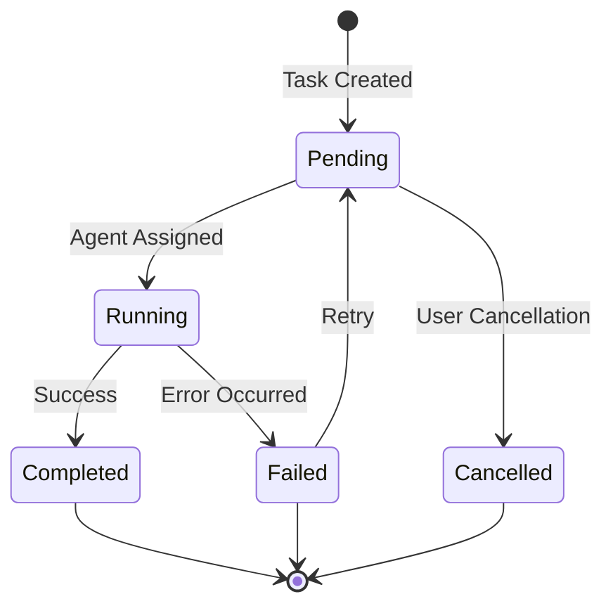

# 5-Minute Quickstart

Get up and running with Abathur in under 5 minutes. This tutorial walks you through installing the CLI, submitting your first task, and checking its status.

## Prerequisites

Before starting, ensure you have:

- **Rust 1.83 or higher** installed ([rustup.rs](https://rustup.rs/))
- **SQLite** (usually pre-installed on macOS/Linux)
- **Anthropic API key** for Claude access
- **Terminal/command line** access
- **Estimated time**: 5 minutes

!!! tip "Check Your Rust Version"
    Run `rustc --version` to verify you have Rust 1.83 or higher.

## Learning Objectives

By the end of this quickstart, you will:

- Install and configure Abathur CLI
- Submit your first task to the queue
- Check task status and understand the task lifecycle
- Know where to go next for deeper learning

---

## Step 1: Install Abathur (< 2 minutes)

First, install Abathur from source:

```bash
# Clone the repository
git clone https://github.com/yourorg/abathur.git
cd abathur

# Build and install
cargo install --path .
```

**Expected Output**:
```
    Finished release [optimized] target(s) in 45.32s
  Installing /Users/you/.cargo/bin/abathur
   Installed package `abathur v0.1.0`
```

**Verify Installation**:

```bash
abathur --version
```

**Expected Output**:
```
abathur 0.1.0
```

!!! success "Installation Complete"
    You now have the `abathur` command available in your terminal.

---

## Step 2: Initialize Configuration (< 1 minute)

Initialize your Abathur workspace:

```bash
# Initialize database and configuration
abathur init
```

**Expected Output**:
```
✓ Created configuration directory: .abathur/
✓ Initialized SQLite database with WAL mode
✓ Cloned template repository
✓ Configuration written to .abathur/config.yaml

Abathur initialized successfully!
```

**Set Your API Key**:

```bash
# Export your Anthropic API key
export ANTHROPIC_API_KEY=sk-ant-your-key-here
```

!!! note "API Key Required"
    You'll need an Anthropic API key to execute tasks with Claude agents. Get one at [console.anthropic.com](https://console.anthropic.com/).

**What Just Happened?**

The `abathur init` command created:

- `.abathur/` directory for configuration and database
- `config.yaml` with default settings
- SQLite database with WAL mode enabled
- Template repository for agent definitions

---

## Step 3: Submit Your First Task (< 1 minute)

Now let's submit a simple task to the queue:

```bash
# Create a task using the task enqueue MCP tool
# Note: In production you'd use the MCP integration,
# but we'll use the CLI for this quickstart
abathur task list --status pending
```

!!! info "MCP Integration"
    Abathur is designed to be used via MCP (Model Context Protocol). Tasks are typically submitted through MCP tools rather than directly via CLI. See the [MCP Integration Guide](../how-to/mcp-integration.md) for details.

For this quickstart, let's check the task queue status instead:

```bash
# Check overall task queue status
abathur task status
```

**Expected Output**:
```
Task Queue Status
─────────────────────────────────────────────────
Total Tasks:      0
Pending:          0
Running:          0
Completed:        0
Failed:           0
Cancelled:        0

Max Concurrent:   10
Current Active:   0
```

**What This Shows**:

- **Total Tasks**: Number of tasks in the system
- **Status Breakdown**: Tasks grouped by their current state
- **Concurrency Settings**: How many tasks can run simultaneously
- **Current Activity**: How many tasks are actively executing

---

## Step 4: Explore Available Commands (< 1 minute)

Let's explore what Abathur can do:

```bash
# View all available commands
abathur --help
```

**Expected Output**:
```
A CLI orchestration system for managing swarms of specialized Claude agents

Usage: abathur [OPTIONS] <COMMAND>

Commands:
  init           Initialize Abathur workspace
  task           Task management commands
  swarm          Swarm orchestration commands
  loop           Loop execution commands
  mcp            MCP server management
  feature-branch Feature branch task management
  help           Print this message or the help of subcommands

Options:
  -c, --config <FILE>  Path to configuration file
  -v, --verbose...     Increase logging verbosity
      --json           Output in JSON format
  -h, --help           Print help
  -V, --version        Print version
```

**Explore Task Commands**:

```bash
# View task management subcommands
abathur task --help
```

**Expected Output**:
```
Task management commands

Usage: abathur task <COMMAND>

Commands:
  list    List tasks with optional filters
  show    Show detailed task information
  status  Show task queue statistics
  cancel  Cancel a task
  retry   Retry a failed task
  help    Print this message or the help of subcommands

Options:
  -h, --help  Print help
```

---

## Step 5: Understanding the Task Lifecycle (< 1 minute)

Tasks in Abathur move through several states:



**Task States Explained**:

- **Pending**: Task submitted, waiting for an available agent
- **Running**: Agent actively executing the task
- **Completed**: Task finished successfully
- **Failed**: Task encountered an error (can be retried)
- **Cancelled**: Task manually cancelled by user

**View Tasks by Status**:

```bash
# List pending tasks
abathur task list --status pending

# List completed tasks
abathur task list --status completed --limit 10
```

---

## Verification

Let's verify your Abathur installation is working correctly:

```bash
# Check configuration
abathur task status

# Verify database initialized
ls -la .abathur/
```

**Expected Output**:
```
total 24
drwxr-xr-x   5 you  staff   160 Oct 29 19:20 .
drwxr-xr-x  15 you  staff   480 Oct 29 19:20 ..
-rw-r--r--   1 you  staff   450 Oct 29 19:20 config.yaml
-rw-r--r--   1 you  staff  8192 Oct 29 19:20 abathur.db
drwxr-xr-x   8 you  staff   256 Oct 29 19:20 templates
```

!!! success "You're Ready!"
    Your Abathur workspace is fully configured and ready for task orchestration.

---

## Next Steps

Now that you've completed the quickstart:

### Learn by Doing
- **[Your First Task](first-task.md)** - Submit and execute a complete task end-to-end
- **[Working with Templates](../tutorials/templates.md)** - Understand agent templates and customization

### Solve Specific Problems
- **[Task Dependencies](../how-to/task-dependencies.md)** - Chain tasks that depend on each other
- **[MCP Integration](../how-to/mcp-integration.md)** - Integrate Abathur with MCP servers
- **[Swarm Orchestration](../how-to/swarm-orchestration.md)** - Run multiple agents concurrently

### Comprehensive Reference
- **[CLI Commands](../reference/cli-commands.md)** - Complete command reference with all options
- **[Configuration](../reference/configuration.md)** - All configuration settings explained
- **[Task States](../reference/task-states.md)** - Detailed task lifecycle documentation

### Understand the Concepts
- **[Architecture Overview](../explanation/architecture.md)** - How Abathur is designed
- **[Task Queue System](../explanation/task-queue.md)** - Deep dive into queue management
- **[Agent Swarms](../explanation/swarms.md)** - Concurrent agent execution model

---

## Troubleshooting

### Issue: `abathur: command not found`

**Cause**: The cargo bin directory is not in your PATH.

**Solution**: Add cargo bin to your PATH:

```bash
# Add to ~/.bashrc or ~/.zshrc
export PATH="$HOME/.cargo/bin:$PATH"

# Reload your shell
source ~/.bashrc  # or source ~/.zshrc
```

### Issue: SQLite database errors

**Cause**: Database file is corrupted or locked.

**Solution**: Reinitialize the workspace:

```bash
# Backup existing data if needed
mv .abathur .abathur.backup

# Reinitialize
abathur init
```

### Issue: API key not recognized

**Cause**: Environment variable not set correctly.

**Solution**: Verify the API key is exported:

```bash
# Check if set
echo $ANTHROPIC_API_KEY

# Set it if missing
export ANTHROPIC_API_KEY=sk-ant-your-key-here

# Make it persistent (add to ~/.bashrc or ~/.zshrc)
echo 'export ANTHROPIC_API_KEY=sk-ant-your-key-here' >> ~/.bashrc
```

### Issue: Permission denied when installing

**Cause**: Insufficient permissions to write to cargo bin directory.

**Solution**: Use cargo install without sudo:

```bash
# Install to user directory (default)
cargo install --path .

# Or specify a custom directory
cargo install --path . --root ~/my-tools
export PATH="$HOME/my-tools/bin:$PATH"
```

---

**Congratulations!** You've successfully installed Abathur and learned the basics. Ready to dive deeper? Start with [Your First Task](first-task.md) to execute a complete workflow.
