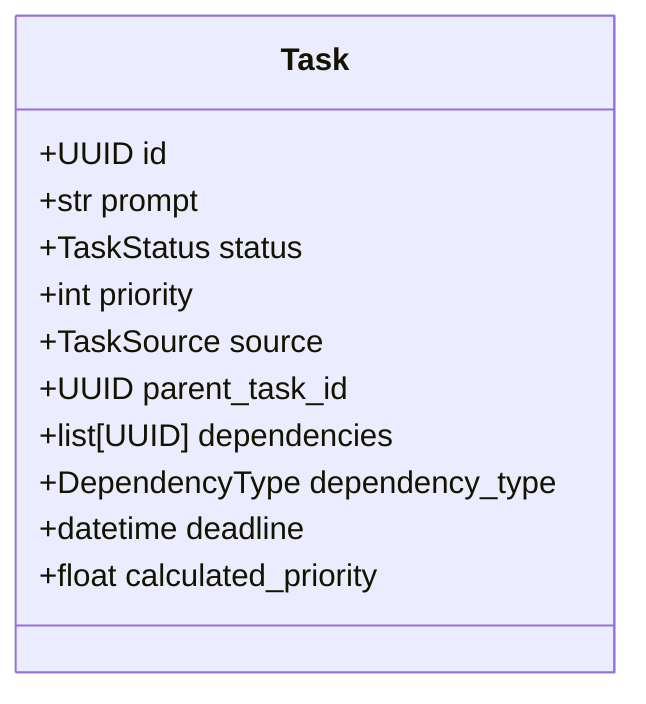
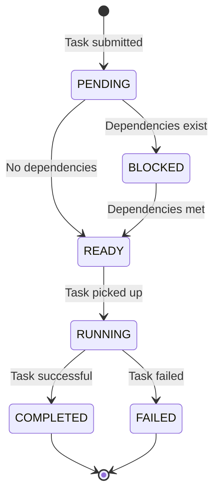
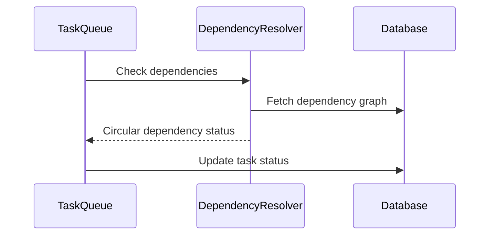
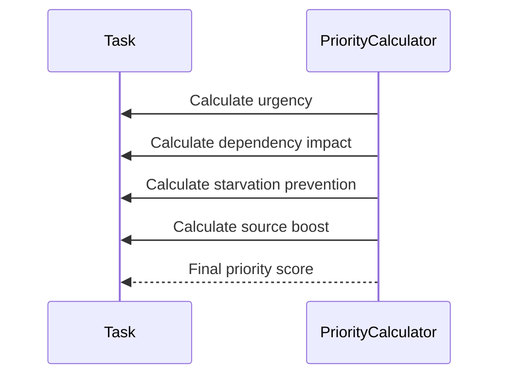

# Task Queue System Architecture

## Overview

The Abathur Task Queue System is a sophisticated task management platform designed to support complex, multi-agent workflows with advanced dependency management and dynamic prioritization.

## System Components

### 1. Domain Models

#### Task Model


#### Enums
- `TaskStatus`: PENDING, BLOCKED, READY, RUNNING, COMPLETED, FAILED, CANCELLED
- `TaskSource`: HUMAN, AGENT_REQUIREMENTS, AGENT_PLANNER, AGENT_IMPLEMENTATION
- `DependencyType`: SEQUENTIAL, PARALLEL

### 2. Service Layer

#### TaskQueueService
Responsible for task submission, retrieval, and lifecycle management.

**Key Responsibilities:**
- Task validation
- Dependency checking
- Priority calculation
- Status management

#### DependencyResolver
Handles complex dependency graph operations.

**Key Algorithms:**
- Circular dependency detection (Depth-First Search)
- Dependency graph building
- Topological sorting

#### PriorityCalculator
Implements dynamic priority scoring.

**Priority Calculation Factors:**
- Base priority
- Deadline proximity
- Dependency blocking impact
- Task waiting time
- Task source

## Database Schema

### Tasks Table
```sql
CREATE TABLE tasks (
    id TEXT PRIMARY KEY,
    prompt TEXT NOT NULL,
    status TEXT NOT NULL,
    priority INTEGER NOT NULL,
    source TEXT NOT NULL,
    parent_task_id TEXT,
    dependencies TEXT,
    calculated_priority REAL,
    deadline TIMESTAMP,
    -- Other metadata fields
);
```

### Task Dependencies Table
```sql
CREATE TABLE task_dependencies (
    id TEXT PRIMARY KEY,
    dependent_task_id TEXT NOT NULL,
    prerequisite_task_id TEXT NOT NULL,
    dependency_type TEXT NOT NULL,
    resolved_at TIMESTAMP
);
```

## System Workflow

### Task Lifecycle


### Dependency Resolution


### Priority Calculation


## Performance Characteristics

### Target Metrics
- **Enqueue Throughput**: 1000+ tasks/second
- **Dependency Resolution**: <10ms (100-task graph)
- **Priority Calculation**: <5ms per task
- **Task Dequeue**: <5ms

### Optimization Strategies
- Efficient indexing
- Short database transactions
- Caching dependency graphs
- Periodic priority recalculation

## Configuration Parameters

```python
PRIORITY_WEIGHTS = {
    "base_weight": 1.0,
    "urgency_weight": 2.0,
    "dependency_weight": 1.5,
    "starvation_weight": 0.5,
    "source_weight": 1.0,
}

MAX_DEPENDENCIES_PER_TASK = 20
MAX_DEPENDENCY_DEPTH = 10
```

## Scalability Considerations

- Supports 10,000+ concurrent tasks
- Horizontal scaling potential
- Efficient memory usage
- Low-overhead operations

## Security & Reliability

- ACID transaction support
- Circular dependency prevention
- Referential integrity constraints
- Comprehensive error handling

## Integrations

- Seamless agent workflow coordination
- Session/memory system integration
- Extensible for custom task sources

## Future Roadmap

1. Machine learning-based priority prediction
2. Advanced visualization tools
3. Enhanced multi-agent coordination patterns

## Conclusion

The Abathur Task Queue System provides a robust, performant solution for managing complex, hierarchical task workflows with intelligent dependency and priority management.
